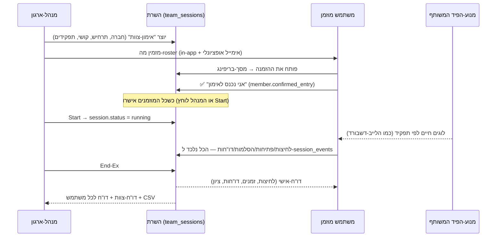
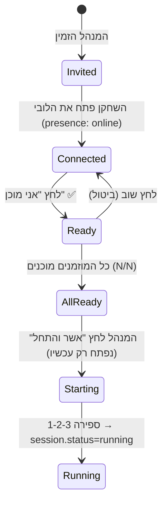

# אפיון — Team SOC (מולטיפלייר): אימון צוותי-SOC לפי תפקידים, ברמה הגבוהה ביותר

> **סטטוס:** אפיון בלבד — אין שינויי-קוד. נכתב 2026-09-13 כמענה לסעיף 7 ברואדמאפ האסטרטגי ("מולטיפלייר SOC / אימון צוותי").
> **שיטה:** שלושה מחקרי-רקע עצמאיים (תפעול-SOC אמיתי · מדע תרגילי-הצוות · מתחרים + ארכיטקטורת-realtime) + מיפוי של מה שכבר קיים בקוד. כל טענה מספרית מקושרת למקור בנספח ה׳; נתוני-ספקים (Prophet, Exaforce, Vectra, Tines, Microsoft/Omdia) מסומנים ככאלה.
> **שלוש העדשות:** המסמך כתוב בו-זמנית מנקודת-המבט של ותיק-SOC (מה באמת נשבר בצוותים), מהנדס בכיר (איך בונים את זה נכון על הסטאק הקיים), ומנהל-מוצר (מה ה-MVP, מה נמדד, מה נחתך).

---

## 0. תקציר-מנהלים

**התזה.** הפלטפורמה היום מאמנת **אנליסט בודד** מול פיד חי — וזה מצוין. אבל SOC הוא **צוות**, והכשלים שעולים לארגונים הכי הרבה כסף הם כשלי-צוות, לא כשלי-יחיד: הסלמה בלי הקשר, מסירה שנכשלת בשקט, הסלמת-יתר מפחד או הסלמת-חסר מעומס, אף אחד לא מנהל את האירוע, מנהלים מתערבים באמצע, ותיעוד שלא מאפשר לשחזר "מי ידע מה ומתי". MITRE מתאר במדויק את הסימפטום כש-monitoring ו-IR לא עובדים כגוף אחד: *"The incident escalation and follow-up process is disjointed and fragmented. Incidents are slow to be followed up, and Tier 1 receives little feedback."*

**הפער בשוק.** אף מתחרה לא סוגר את זה בדפדפן:
- Immersive Labs (Crisis Sim) — תפקידים **בלי כלים** (טייבל-טופ, "מסירת-שרביט" סדרתית).
- RangeForce / Cyberbit / SimSpace / Cloud Range — כלים **בלי תפקידים מובנים** (ranges כבדים, $7K–$25K+/שנה + שבועות התקנה; "עבודת-צוות" מוערכת ע"י מדריך אנושי, לא ע"י הפלטפורמה).
- TryHackMe SOC Sim — תור משותף **בלי תפקידים** ובלי הסלמה אדם-לאדם.
- LetsDefend / CyberDefenders / BTL / BOTS — יחיד בלבד או CTF קבוצתי.
- **אף פלטפורמה שנמצאה לא מנקדת איכות-מסירה** (האם T1 הסלים עם הראיות הנכונות, כמה זמן עד ש-T2 אישר, האם מנהל-האירוע עודכן). HTB Threat Range (ספט׳ 2025) הוא המתחרה הקרוב ביותר בהצהרות ("team-based, role-specific") אבל ללא מכניקה או מחיר פומביים.

**המוצר במשפט אחד.** **Incident Room** — 3–6 מתאמנים + מדריך, חברה אחת, קמפיין-תקיפה אחד, כל מתאמן בקונסולת-תפקיד משלו (T1 · T2 · Incident Lead · Detection Engineer · Threat Intel · SOC Manager), עם **הסלמות מובנות ומנוקדות**, חדר-מלחמה + יומן-החלטות, תיק משותף, **קונסולת-בקרה למדריך** (MSEL/injects/לחץ/עצירה), **יריב-AI מסתגל + דמויות-AI** (משתמש, Help-desk, CISO, עיתונאי), ו-**AAR אוטומטי** שמשחזר את ציר-התקיפה מול ציר-התגובה מתוך יומן-אירועים.

**למה זה בר-ביצוע עכשיו.** ~60% מהמנוע כבר קיים: מנוע הפיד החי + סיפורי-תקיפה מקוטעים (`useLiveEvents.ts`), קונסולת EDR, ה-grader הדו-שכבתי (דטרמיניסטי + AI-prose), מודל-הארגונים עם תפקיד `instructor`, `assignments`, תקציבי-AI, audit-log ודוא"ל. **מה שחסר — realtime (אפס שימוש היום), יומן-אירועים משותף, מכונת-מצבים לפי תפקיד, וקונסולת-מדריך** — כולו בנוי על Supabase Realtime + Postgres, ללא VM ובלי תשתית חדשה.

**מספרי-עוגן.** גודל-צוות אופטימלי לתרגול-ידיים 4–6 (3 לדיון; ≥7 = process loss); משך 60–90 דק׳ (+15–20 דק׳ hot-wash); debrief מונחה משפר ביצועי-צוות ב-≈25% (d=0.67; team-level d=1.20 — Tannenbaum & Cerasoli 2013); T1 מקבל 1–15 דק׳ לאירוע ומסלים 10–20% (בריא); ניקוד: 65–75% טכני / 25–35% לא-טכני (Locked Shields). עלות-תשתית לפיילוט ≈ $60–80/חודש לפני LLM; עלות-LLM מוערכת $1–3 לסשן.

**המלצת-PM.** MVP של **3 תפקידים** (T1/T2/Incident Lead) + הסלמה מובנית + war-room + קונסולת-מדריך בסיסית + AAR אוטומטי — זה כבר מוצר שאין לאף אחד. DE/TI/Manager ו-AI-simcell בשלב 2.

---

## 1. מחקר — מה למדנו (תמצית מכוונת-עיצוב)

### 1.1 איך SOC אמיתי עובד כצוות (ותיק-SOC)

| ממצא | מקור | השלכה לעיצוב |
|---|---|---|
| SOC = חמש פונקציות אטומיות תחת פיקוד אחד: Tier-1 triage · Tier-2+ analysis/response · CTI · sensor tuning · tool engineering. פיצול ביניהן → "depressed ops tempo, animosity/distrust" | MITRE Ten/11 Strategies | ששת התפקידים במוצר ממפים 1:1 לפונקציות; המדריך = "SOC leadership" |
| T1: 1–15 דק׳ לאירוע; "אם לוקח יותר מכמה דקות — מסלימים"; 2–6 אנליסטים במשמרת; **לעולם לא פיד לא-מסונן** | MITRE §2.2, §7.2.2 | תור-T1 עם SLA-לאירוע; המנוע כבר מסנן; מד-עומס |
| הסלמה בריאה 10–20% (>25–30% = תקלה); דיוק-הסלמה 30–70%; סגירה-T1 70–85%; "closure 95% = כנראה מסלים-חסר" | Daylight, Exaforce, cybersecuritynews (vendor) | ניקוד T1 על **דיוק** ההסלמה, לא על כמות |
| T2 "accepts cases from Tier 1... runs incidents to ground"; אנטי-דפוס: reimage רפלקסיבי בלי לדעת אם התוקף איבד אחיזה | MITRE §4.2, §11 | T2 מנוקד על ציר-זמן/scoping/ראיות, לא על "לחצתי Isolate" |
| ENISA: 4 תפקידי-חובה — duty officer, triage officer, incident handler, **incident manager** ("decide how to act in problematic situations") | ENISA Incident Mgmt Guide §6.1 | Incident Lead הוא תפקיד-חובה בכל צוות (גם ב-3) |
| NIST 800-61r3: "designate an incident lead"; מי מוסמך "to confiscate, disconnect, or shut down"; הסלמה ≠ העלאה (escalation = משאבים/זמן; elevation = הנהלה) | NIST SP 800-61r3 | פעולות-הכלה **דורשות אישור** של ה-Lead; שני סוגי-הסלמה במוצר |
| Incident Commander: "coordinate, not make technical changes"; "single source of truth"; מוסמך להוציא את ה-CEO מהשיחה; "Do you wish to take command?" | PagerDuty IR docs | ה-Lead **לא** חוקר בעצמו — הקונסולה שלו היא לוח-מצב + יומן-החלטות; inject "מנכ"ל מתערב" |
| כרטיס-הסלמה טוב = alert גולמי + חבילת-enrichment + נימוק מתועד + הערכת-impact/scope; "Escalate signals, not doubts" | Exaforce, NIST RS.MA, Deepwatch | טופס-הסלמה **מובנה** עם שדות-חובה ו-confidence |
| Passdown log (MITRE נספח D): מי במשמרת, תיקים שנפתחו/נסגרו, הסלמות החוצה, תקלות-חיישנים, פעילות שעוד לא הפכה לתיק, משימות פתוחות; שני המנהיגים חותמים | MITRE App. D; Hunto | פורמט "מסירת-משמרת" מובנה ומנוקד (פורמט B) |
| תקשורת: שני ערוצים (war-room טכני / עדכוני-הנהלה); SEV1 עדכון כל 20–30 דק׳ עם "Next update by"; "measured updates at measured times"; ג'וניור שמדליף חצי-מידע הורס אמינות | incident.io, MITRE §11, PagerDuty | טיימר-cadence ל-Lead; פעולת "עדכון-הנהלה" מנוקדת; inject "עיתונאי פונה ל-T1" |
| ה-"so what" למנהלים: מה/מי הותקף · האם התוקף הצליח · מי ולמה · איך ממשיכים | MITRE §11 | תבנית SITREP של ארבע שאלות |
| Chain-of-custody: "log all evidence — how, when, who"; ציר-זמן UTC; "timeline of the adversary AND timeline of how the SOC responded" | CISA playbook, NIST RS.AN-06/07 | AAR דו-מסלולי: ציר-תקיפה מול ציר-תגובה — נגזר אוטומטית |
| מציאות-המשמרת: ~3,000 התראות/יום ממוצע, 46% FP, 63% לא מטופלות, 10.9 קונסולות, 63% שחוקים; "the boring 90%" | Vectra 2026, Microsoft/Omdia 2026, Tines 2023 (vendor) | פאזת "משמרת שקטה" עם עבודה שגרתית לפני הקמפיין; הפרעות מכוונות |
| מטריקות מזיקות: tickets closed, time-to-close, #rules. טובות: time-to-detect/respond מאומת בתרגיל, FP rate, שביעות-רצון אנליסטים | NCSC UK | לא מנקדים throughput; מנקדים איכות-החלטה וזמנים עם חלונות-סובלנות |
| Dwell time חציוני 11 יום (M-Trends 2025); 22 שניות מ-initial access למסירה למפעיל משני (M-Trends 2026); 1-10-60 (CrowdStrike) | Mandiant, CrowdStrike | "עומק-kill-chain בעת הכלה" כמדד-outcome מרכזי |

### 1.2 איך בונים תרגיל-צוות שעובד (מדע-התרגילים)

| ממצא | מקור | השלכה לעיצוב |
|---|---|---|
| מבנה קנוני: objectives → scenario → **MSEL** (רשימת-אירועים כרונולוגית + expected actions) → **injects** (זמן/למי/ממי/ערוץ/טקסט) → control cell נפרד → data collectors → **hotwash** → AAR | NIST SP 800-84 §5 | קונסולת-המדריך = MSEL חי; כל inject נשמר עם expected action לניקוד |
| תפקידי-בקרה: Exercise Director · **MSEL Manager** (משחרר contingency injects) · **SimCell** (משחק ישויות חיצוניות) · **Ground Truth Advisor** (עקביות-סיפור) · Evaluators | HSEEP 2020 Table 4.2 | המדריך = Director; ה-AI = SimCell + Ground-Truth; ה-grader = Evaluator |
| "injects should keep participants occupied but not overwhelmed"; "short, concise scenario so participants don't critique the scenario" | NIST 800-84 | "pressure dial" למדריך; ROE: "fight the problem, not the scenario" |
| שלושה ארכיטיפים: Tabletop (הכל כתוב) · **Hybrid** (injects כתובים, תוקף חי) · Full-Live (white team מאלתר לפי התקדמות) | Seker (CCDCOE) | MVP = Hybrid; שלב 2 = Full-Live עם יריב-AI |
| "Blonde users" — משתמשים מדומים שפותחים קבצים ומגישים tickets; הצוות חייב לטפל בהם | Seker | AI-personas שמייצרים פניות-help-desk באמצע התקיפה |
| Injects חייבים מטרה: לכפות החלטה / לחשוף תלות / ליצור לחץ-זמן / לחשוף פערי-תקשורת / לאתגר הנחות; ארכיטיפים: **contradictory guidance**, **simulated consequences**, **resource removal**, **fog of war** | bcmmetrics, The Cyber Instructor | ספריית-injects מטופסת לפי מטרה (נספח ג׳) |
| Injects לפי **milestone** ולא רק לפי זמן; "milestone logic is the hardest cognitive shift for designers"; branching לפי החלטות-צוות | Vykopal et al. 2026 | טריגרים: `at_time` / `on_milestone` / `on_action` / `manual` |
| Guiding injects להחזיר צוות למסלול; "pressure should not be so great that participants completely fail" | ENISA | contingency injects + מדד-בריאות-צוות למדריך |
| Locked Shields: 65–75% טכני (uptime 35 / attacks 35 / forensics 10–15) · 25–35% לא-טכני (reporting 15–20 / legal-media 10–15); סולם-12 (0/4/6/8/12); 42% מהתלונות = **חוסר-שקיפות בניקוד** | Frontiers in Education 2022 | רובריקה גלויה מראש; ניקוד ידני על סולם אחיד; אין "ניקוד סמוי" |
| ביצועי-צוות ≠ אפקטיביות-צוות; מדדי-outcome שונים מדרגים צוותים **שונה** ("each metric favors a strategy"); הצוות המנצח: **החליט על ארגון-צוות, עקב אחרי אסטרטגיה, החליף מידע** | Granåsen & Andersson 2016 | ניקוד = outcome + process; "האם הצוות הגדיר תפקידים ב-5 הדקות הראשונות" נמדד |
| "self-assessed expertise is an inadequate predictor"; היכרות-מוקדמת לא מנבאת שיתוף-פעולה | Granåsen & Andersson | לא מסתמכים על self-report; מדדים התנהגותיים מהיומן |
| מנבאי-מיומנות: Time-to-Detect, Time-to-Approval, Time-to-End, Category-Correct; "functional role-specialization" חשוב | Henshel et al. 2016 | ארבעת המדדים = ליבת ה-scorecard |
| צוותים גדולים מזיקים; מסירת-alerts בין אנליסטים משפרת; שלושת האתגרים: structure, communication, information overload | Rajivan & Cooke | 4–6 מקסימום; מסירה = מכניקה מרכזית |
| Debrief: +25% אפקטיביות (d=.67); **מונחה ×3 מלא-מונחה**; team-level d=1.20; ממוצע 18 דק׳; ארבעה יסודות: self-learning, לא-עונשי, אירועים ספציפיים, ריבוי-מקורות | Tannenbaum & Cerasoli 2013 | hot-wash מובנה ומונחה, 15–20 דק׳, על אירועים מהיומן, לא על "כישורים" |
| פידבק מגיע "חודש אחרי" בתרגילים הגדולים → הצוותים רוצים "how it happened", replay | Vykopal 2018 | AAR מיידי + נגן-replay |
| AAR צבאי: 4 שאלות (מה תוכנן · מה קרה · מה נכון/שגוי · מה עושים אחרת); "identify the duty position, not the person"; שאלות פתוחות; המנחה עוזב בסוף | US Army Leader's Guide to AAR | תסריט-hot-wash מובנה (§6.6) |
| 3 = גודל אופטימלי לדיון; ≥4 מראה ניתוק; ידיים: 4/צוות (Cyber Czech), 6–10 תקרה (Crossed Swords); TTX 60–90 דק׳ | Vykopal 2026, NÚKIB, CCDCOE | 3–6, 60–90 דק׳ |
| תחרות ממריצה אבל גורמת score-gaming ופזיזות; הסתרת-דירוג נכשלת (צוותים מפרסמים לבד) | Frontiers 2022, Granåsen | leaderboard **opt-in** ברמת-הארגון; ברירת-מחדל = למידה |
| Green team מסייע **תמורת נקודות-עונשין** | Cyber Czech | "רמז ממחיר" — hint שעולה נקודות-צוות |
| Cross-training/rotation → shared mental models → coordination → performance | Marks et al. 2002; Salas 2008 | פורמט "סבב-תפקידים" (4 סשנים, כל אחד בתפקיד אחר) |

### 1.3 נוף תחרותי — table-stakes מול פתחי-בידול

**Table-stakes** (כולם הרציניים מציעים): סביבה משותפת לאותו אירוע · ציר-זמן עם MTTD/MTTR ל-debrief · מיפוי ATT&CK · דוחות-מדריך per-individual/team · leaderboard · ניקוד-AI לדוח.

**מה אף אחד לא מציע בפלטפורמה (פתחי-הבידול שלנו):**
1. **הסלמה אדם-לאדם כמכניקה מנוקדת** (איכות-מסירה, ack latency, ראיות מצורפות, האם ה-Lead עודכן).
2. **קונסולות-תפקיד נפרדות בחדר-אירוע אחד בדפדפן**, עם פעולות מוגבלות-תפקיד.
3. **War-room + יומן-החלטות שנלכדים ל-AAR** ("we replay your team's communication against the attack timeline").
4. **קונסולת-מדריך עם injects חיים, pause, ו-branching** — בלי VM ובלי $25K.
5. **AAR שמשחזר who-knew-what-when** ממוקד-קואורדינציה (Cyberbit — היחיד שמפרסם משהו דומה — ממוקד-achievement ליחיד).
6. **מחיר** — כל מוצרי-הצוות הם quote-only enterprise; מקום ריק ל"מחיר לכיתה/קוהורט".

### 1.4 עקרונות-עיצוב (נגזרים)

1. **תפקיד = הגבלה, לא רק תצוגה.** T1 לא יכול לבודד host; ה-Lead לא יכול לפתוח raw. הגבלה היא מה שמייצר תלות-הדדית וממית את "השחקן-הגיבור".
2. **הסלמה היא אובייקט טיפוסי, לא הודעת-צ'אט.** `requested → acknowledged → accepted/bounced → resolved`. הזמנים והתוכן בין המצבים הם ציון-הקואורדינציה.
3. **process + outcome, team + individual-within-team.** רובריקה גלויה; המדריך יכול לתקן post-hoc; כל תיקון = event מתועד.
4. **המדריך הוא Exercise Director, לא נגן.** רואה הכל, מזריק, מאט/מאיץ, עוצר, לא "משחק" — אלא אם בחר לשחק SOC Manager.
5. **ה-AI ממלא את מה ש-white-team אנושי עשה ב-Locked Shields:** SimCell (משתמשים, help-desk, הנהלה, תקשורת), Ground-Truth, יריב מסתגל, מנטור סוקרטי — ותמיד עם עמוד-שדרה דטרמיניסטי לניקוד (כמו ה-grader הקיים).
6. **יומן-אירועים append-only הוא האמת היחידה.** ממנו נגזרים: מצב-חי, ניקוד, replay, AAR, אנליטיקה. שום ניקוד לא מחושב בלקוח.
7. **"fight the problem, not the scenario".** תסריט קצר, עקבי, ראיות-ספק אמיתיות (כמו היום), אפס "hints" ב-raw.
8. **Debrief מונחה הוא חצי מהלמידה** — לכן ה-hot-wash הוא מסך מוצר, לא PDF.
9. **ברירת-מחדל למידה, לא תחרות.** leaderboard opt-in.
10. **Realistic boredom.** 5–10 דק׳ של משמרת שקטה עם עבודה שגרתית לפני שמשהו קורה.

---

## 2. חזון, פרסונות ופורמטים (PM)

### 2.1 Jobs-to-be-done

| פרסונה | ה-Job | מה מתסכל היום | הצלחה |
|---|---|---|---|
| **מרצה במכללת-סייבר** (הלקוח המשלם, `instructor`) | "להריץ שיעור-צוות של 90 דק׳ ל-20 סטודנטים (4 חדרים × 5) ולצאת עם ציון-לצוות + ציון-ליחיד + מה ללמד בשבוע הבא" | היום כל סטודנט לבד; אין דרך להעריך תקשורת/הסלמה; תרגילי-צוות = טייבל-טופ ידני | מריץ 4 חדרים במקביל מקונסולה אחת; מקבל AAR אוטומטי + CSV |
| **מנהל-SOC ארגוני** (B2B עתידי) | "תרגול רבעוני של הצוות שלי על תרחיש עדכני, בלי range של $25K, עם ראיות לרגולטור/ביקורת" | ranges יקרים ומסורבלים; TTX לא מתרגל כלים | 60 דק׳, אפס התקנה, דוח AAR ל-audit |
| **סטודנט / אנליסט** | "להבין איך אני מתפקד **בתוך צוות** — לא רק האם מצאתי את הבאקדור" | לומד לבד; אין חוויית-הסלמה/מסירה אמיתית | יודע מה התפקיד שלו, מקבל פידבק אישי-בתוך-צוות, מסתובב בין תפקידים |
| **סופר-אדמין (טל)** | "להציע למכללות משהו שאין לאף אחד, במחיר-לכיתה" | תחרות על תוכן-יחיד | פיצ'ר-דגל B2B עם פילוח-מחיר משלו |

### 2.2 פורמטים (מוצר אחד, ארבעה מצבי-משחק)

| פורמט | תיאור | משך | צוות | מתי |
|---|---|---|---|---|
| **A. משמרת-צוות** (ליבה) | קמפיין אחד, צוות אחד, מדריך אחד; שיתופי | 60–90 + 15–20 hot-wash | 3–6 | MVP |
| **B. מסירת-משמרת** | שני צוותים ברצף על **אותו** אירוע: צוות 1 עובד 40 דק׳, כותב passdown, צוות 2 ממשיך 40 דק׳ | 2×40 + 20 | 2×3–4 | שלב 2 |
| **C. צוות-מול-צוות** | אותו seed לכמה חדרים במקביל; השוואה ב-AAR; leaderboard opt-in | 60–90 | N×3–6 | שלב 2 |
| **D. סבב-תפקידים** | סדרה של 4 סשנים שבה כל מתאמן עובר T1→T2→Lead→DE | 4×60 | קבוע | שלב 3 |

### 2.3 מה **לא** בונים (חיתוכי-PM מכוונים)

- לא VM/range, לא malware אמיתי, לא uptime של שירותים — ה"outcome" שלנו הוא **עומק-kill-chain בעת הכלה**, לא זמינות.
- לא מסמך-שיתופי (CRDT) — הערות-תיק הן append-only (זה גם מה שיומן-אירועים אמיתי עושה).
- לא צ'אט-וידאו — הצוותים בכיתה או ב-Zoom/Teams משלהם; ה-war-room הוא **טקסטואלי כדי שיילכד ל-AAR** (ההנחיה מ-Vykopal 2026: תרגול מרוחק מלווה בערוץ-חיצוני).
- לא ניקוד-חי על המסך בזמן-אמת (מעודד score-gaming — Granåsen); רק "מצב-תיק" ו-SLA.

---

## 3. התפקידים — מה כל אחד רואה, עושה, ומה מודדים

**הקצאה לפי גודל-צוות:** 3 = T1 · T2 · Incident Lead | 4 = + Detection Engineer | 5 = + Threat Intel | 6 = + SOC Manager (או T1 שני — "2–6 T1 במשמרת" לפי MITRE). המדריך יכול "לשחק" SOC Manager בצוותים קטנים. NICE = מסגרת NIST NICE (Work Roles), בהמשך למיפוי הקיים ב-`docs/nice-framework-mapping.md`.

### 3.1 Tier-1 Triage Analyst

| | |
|---|---|
| **המשימה** | לשמור על התור נקי: לזהות מה אמיתי, לסגור FP **עם נימוק**, להסלים מה שחוצה סף — מהר ובדיוק |
| **הקונסולה** | הפיד החי הקיים (SIEM/EDR/cloud/email…) + **תור-triage** ממוין לפי `ruleLevel`/SLA + כרטיס-disposition לכל אירוע (TP/FP/Benign-true/Needs-T2) + טופס-הסלמה מובנה + ערוץ help-desk (פניות AI-users) |
| **פעולות מותרות** | disposition · הסלמה ל-T2 · הצמדת ראיה לתיק · פנייה ב-war-room · סגירת ticket של משתמש · **לא**: isolate, block, reset password, איפוס-כלל |
| **קלט/פלט** | קלט: alerts, פניות-משתמשים, intel-notes מ-TI. פלט: dispositions מתועדים, כרטיסי-הסלמה, tickets סגורים |
| **NICE** | PR-CDA-001 Cyber Defense Analyst (T0020, T0023, T0155, T0164) |
| **KPI אישיים** | דיוק-disposition (מול ground-truth) · **דיוק-הסלמה** (כמה הסלמות אושרו ע"י T2) · שלמות כרטיס-הסלמה (שדות-חובה + ראיות) · time-to-triage לאירועי high/critical · אחוז FP שנסגרו עם נימוק תקף · טיפול ב-tickets בזמן |
| **מצוין** | "escalate signals, not doubts": כרטיס עם raw + enrichment + נימוק + confidence; סוגר FP עם הסבר-מנגנון; לא מסלים "ליתר-ביטחון" |
| **חלש** | closure-rate 95%+ (מסלים-חסר) או הסלמה >30% (מפחד); כרטיסים ריקים ("נראה חשוד"); מתעלם מפניות-משתמשים; שוכח ראיות |

### 3.2 Tier-2 Investigator

| | |
|---|---|
| **המשימה** | לקבל הסלמות, לבנות **ציר-זמן**, לקבוע scope ו-impact, להמליץ הכלה, ולסגור את התיק לעומק |
| **הקונסולה** | תור-הסלמות נכנסות (ack/bounce) + התיק המשותף + **קונסולת ה-EDR הקיימת** (process tree, RTR-lite, hash lookup) + חיפוש/פיווט בפיד (eventSearch) + בונה-ציר-זמן (drag events → timeline) + כותב-דוח |
| **פעולות** | ack/bounce הסלמה · עדכון סטטוס-תיק (Investigating/Contained…) · הצמדת ראיות · **בקשת-אישור-הכלה** מה-Lead · isolate/kill (רק אחרי אישור) · הסלמה ל-Lead (elevation) · בקשת intel מ-TI · בקשת כלל מ-DE |
| **NICE** | PR-CIR-001 Cyber Defense Incident Responder (T0041, T0047, T0161, T0163, T0175) |
| **KPI** | escalation-ack latency · דיוק ציר-הזמן (מול chain האמיתי) · שלמות-scoping (hosts/users/techniques שזוהו ÷ אמיתיים) · איכות המלצת-ההכלה (נכונה + מנומקת + בזמן) · reopen-count · דוח-אירוע (ה-grader הקיים) |
| **מצוין** | מאשר קבלה תוך דקות; בונה ציר-זמן לפני שמבקש הכלה; מבקש אישור **עם** נימוק-impact; מחזיר פידבק ל-T1 ("ההסלמה הזו הייתה נכונה כי…") |
| **חלש** | reimage/isolate רפלקסיבי; שוכח לאשר קבלה (T1 לא יודע אם מישהו מטפל); מפקיע את תפקיד ה-Lead; ציר-זמן רק מה-EDR |

### 3.3 Incident Lead (Incident Commander)

| | |
|---|---|
| **המשימה** | "single source of truth": לתאם, להחליט, לאשר פעולות-הכלה, לעדכן בעלי-עניין — **לא לחקור בעצמו** |
| **הקונסולה** | **לוח-מצב** (Situation Board): כל התיקים + סטטוס + owner + SLA; תור-בקשות-אישור; **יומן-החלטות** (כניסה מסומנת DECISION עם נימוק); טיימר-cadence ("next update by"); תבנית SITREP (4 שאלות MITRE); ערוץ-הנהלה (AI-CISO/CEO); **בלי** raw-log (רק סיכומים שהצוות מייצר) |
| **פעולות** | approve/deny containment · assign owner · set severity · הסלמה-חיצונית (legal/HR/LE) · SITREP · "take command"/"hand over command" · בקשת מצב ("CAN: Condition-Actions-Needs") · פתיחת תיק שני |
| **NICE** | PR-CIR-001 (מנהיגות) + OV-MGT-001 Cyber Program Manager (חלקי); ENISA "incident manager" |
| **KPI** | time-to-approval (Henshel) · נכונות-אישורים (אישר הכלה נכונה / דחה מיותרת) · שלמות יומן-החלטות (החלטה + נימוק + זמן) · עמידה ב-cadence · איכות SITREP · "decided on organization" ב-5 הדקות הראשונות · טיפול ב-injects הנהלה/תקשורת |
| **מצוין** | פותח ב-"This is X, I'm the incident lead", מחלק תפקידים, מאשר תוך דקות עם נימוק, עדכון-הנהלה כל 20–30 דק׳, מסרב ל-CEO בנימוס ("Do you wish to take command?") |
| **חלש** | "צולל" ל-raw ומפסיק לתאם; מאשר בלי לשאול "מה ה-impact"; שוכח עדכון-הנהלה עד שה-inject של ה-CEO מגיע; לא מתעד החלטות |

### 3.4 Detection Engineer

| | |
|---|---|
| **המשימה** | לסגור פערי-זיהוי **תוך כדי** האירוע: לכתוב/לכוונן כלל, לבדוק FP על הפיד החי, לתעד coverage |
| **הקונסולה** | עורך-כללים על שפת-הסינון של הפלטפורמה (predicates של `eventSearch`/filters → בעתיד KQL/SPL-lite, REALISM #13) + **backtest** מיידי על אירועי-הסשן (כמה TP/FP הכלל תופס) + מפת-coverage ATT&CK של הסשן + תור-בקשות מ-T2 ("צריך כלל ל-T1021.001 מ-host X") |
| **פעולות** | publish rule (מייצר alert חדש בפיד לכולם — "SIEM-CUSTOM-xxx") · tune rule · suppress FP-pattern (מנומק) · דיווח coverage-gap ל-Lead |
| **NICE** | PR-CDA-001 + AN-TWA-001 (חלקי); Rapid7 detection-engineering lifecycle |
| **KPI** | rules verifiable (נתפס בפועל ב-backtest) · FP-rate של הכלל על הפיד · זמן מבקשה ל-publish · coverage-delta ATT&CK · תיעוד |
| **מצוין** | כלל צר שתופס את שלב-התקיפה הבא **לפני** שהוא קורה; מסביר לצוות מה הכלל תופס |
| **חלש** | כלל על IP בודד ("alert inflation", NCSC); כלל שמציף את T1 |

### 3.5 Threat-Intel Analyst

| | |
|---|---|
| **המשימה** | להפוך IOCs ל-הקשר: איזה actor/campaign, מה השלב הבא הצפוי, מה לחסום, ולתמוך ב-IR |
| **הקונסולה** | ה-ThreatIntel drawer הקיים + "מאגר-intel" סימולטיבי של הסשן (דוחות-ספק מדומים על הקמפיין — נגזרים מה-story) + עורך **Intel Note** (confidence · relevance · recommended action) + תור-בקשות מ-T2/Lead |
| **פעולות** | publish intel note (מופיע ל-T1/T2/Lead) · תיוג actor/campaign על התיק · הצעת IOCs לחסימה (ה-Lead מאשר) · ניבוי "next expected technique" |
| **NICE** | AN-TWA-001 Threat/Warning Analyst; NIST RS.CO information-sharing |
| **KPI** | actionable-rate (כמה notes הובילו לפעולה) · time-to-action · דיוק-ייחוס (actor/technique) · דיוק-ניבוי השלב הבא · FP של IOCs מוצעים |
| **מצוין** | note קצר עם confidence מפורש, לפני שהשלב הבא קורה |
| **חלש** | "Wall of IOCs" בלי המלצה; ייחוס בלי confidence |

### 3.6 SOC Manager / Shift Lead (אופציונלי; המדריך יכול לשחק)

| | |
|---|---|
| **המשימה** | עומס, SLA, סדרי-עדיפויות, מסירת-משמרת, "run interference" מול ההנהלה |
| **הקונסולה** | לוח-עומס (alerts/analyst, SLA breaches, תיקים פתוחים) + passdown-log editor + ערוץ-הנהלה |
| **פעולות** | re-assign · שינוי-עדיפות · פתיחת T1 שני (AI-assist) · חתימה על passdown · elevation להנהלה |
| **KPI** | SLA adherence · איזון-עומס · איכות passdown (MITRE נספח D) · reopen-rate |

### 3.7 מטריצת תפקיד × פעולה (Role-gated actions)

| פעולה | T1 | T2 | Lead | DE | TI | Mgr |
|---|:-:|:-:|:-:|:-:|:-:|:-:|
| disposition על אירוע (TP/FP/benign) | ✅ | ✅ | — | — | — | — |
| הסלמה ל-T2 (typed) | ✅ | — | — | — | — | — |
| ack/bounce הסלמה | — | ✅ | ✅ | — | — | — |
| הצמדת ראיה לתיק | ✅ | ✅ | — | ✅ | ✅ | — |
| עדכון סטטוס-תיק | — | ✅ | ✅ | — | — | ✅ |
| **בקשת-אישור-הכלה** | — | ✅ | — | — | — | — |
| **אישור/דחיית הכלה** | — | — | ✅ | — | — | ✅* |
| isolate host / kill process (EDR) | — | ✅ (אחרי אישור) | — | — | — | — |
| block IOC | — | — | ✅ | — | הצעה | — |
| publish detection rule | — | — | — | ✅ | — | — |
| publish intel note | — | — | — | — | ✅ | — |
| SITREP / עדכון-הנהלה | — | — | ✅ | — | — | ✅ |
| DECISION ביומן | — | — | ✅ | — | — | ✅ |
| מענה ל-help-desk ticket | ✅ | — | — | — | — | — |
| פתיחת raw-log מלא | ✅ | ✅ | ❌ | ✅ | ✅ | ❌ |
| passdown log | — | — | — | — | — | ✅ |

\* Manager מאשר רק אם ה-Lead לא זמין (inject "Lead נותק").
**חריגה מכוונת:** כל תפקיד יכול "לבקש" כל פעולה בצ'אט — אבל רק בעל-ההרשאה מבצע. זה בדיוק מה שמלמד תלות-הדדית.

---

## 4. זרימת-התרגיל מקצה-לקצה

### 4.1 שלבים

| # | שלב | משך | מה קורה | מה נלכד |
|---|---|---|---|---|
| 0 | **Lobby & Briefing** | 5 | המדריך יוצר Incident Room (חברה, קמפיין, קושי, פורמט, גודל); מתאמנים מצטרפים בקוד; **הצוות מחלק תפקידים בעצמו** (או המדריך); ROE: "fight the problem", "no-fault", "Lead is single source of truth"; מטרות-הסשן גלויות | milestone `team.organized` + זמן עד אליו (Granåsen: מנבא) |
| 1 | **משמרת שקטה** | 5–10 | פיד רגיל (benign + FP-decoys); tickets של משתמשים; TI מקבל advisory שגרתי; DE מקבל בקשת-tuning שגרתית; Lead מקבל בקשת-status מהמנהל | dispositions בסיסיים, "boring 90%" |
| 2 | **קמפיין** | 30–50 | ה-story מוזרק בקטעים (chunk4 הקיים) + injects לפי MSEL: פניית-משתמש "המחשב איטי", advisory של TI שמתאים לקמפיין, help-desk מבקש איפוס-MFA (vishing), CISO שואל "מה קורה", עיתונאי ל-T1, resource-removal ("ה-EDR של host X לא מדווח"), **second incident** (מסיח או אמיתי) | כל הסלמה/ack/החלטה/הודעה; זמנים |
| 3 | **נקודת-הכרעה** | 5–10 | T2 מבקש הכלה → Lead חייב להחליט עם impact ("host X הוא שרת-הפקה"); inject הנהלה נגדית ("אל תבודדו — יש דמו ללקוח"); DE מפרסם כלל; TI מנבא שלב-הבא | time-to-approval, נכונות |
| 4 | **סגירה / מסירה** | 5–10 | דוח-אירוע (T2), SITREP סופי (Lead), passdown (Mgr/Lead) בפורמט B; End-Ex ע"י המדריך | דוחות + ציונים דטרמיניסטיים |
| 5 | **Hot-wash** | 15–20 | מסך AAR: ציר-תקיפה מול ציר-תגובה, "who-knew-what-when", 4 שאלות ה-AAR, per-role feedback, מדריך מנחה עם תסריט; תיקוני-ניקוד ידניים | `grade.assigned`, `grade.overridden` |
| 6 | **דוחות** | אסינכרוני | דוח-צוות + דוח-אישי-פרטי (Seker: "private report per blue team") + CSV למדריך + עדכון מפת-מיומנויות NICE | — |

### 4.2 זרימת-הסלמה טיפוסית (הלב של המוצר)

```mermaid
sequenceDiagram
    autonumber
    participant F as Live Feed (server)
    participant T1 as T1 Triage
    participant T2 as T2 Investigator
    participant L as Incident Lead
    participant E as EDR console
    participant X as AI SimCell (CISO / user)
    F->>T1: high-sev alert (PowerShell encoded, host FIN-WS-07)
    T1->>T1: disposition = Needs-T2 (+ enrichment, raw, confidence 0.7)
    T1->>T2: escalation.requested {evidence:[e1,e2], why, impact-guess}
    Note over T2: SLA ack 5 min (clock starts)
    T2->>T1: escalation.acknowledged
    T2->>E: investigate host (process tree, hash lookup)
    T2->>T2: case.timeline += 4 events; scope = {hosts:2, users:1}
    T2->>L: containment.requested {isolate FIN-WS-07, impact: user offline}
    X->>L: inject: CISO "מה קורה? יש דמו בעוד 20 דק׳"
    L->>L: DECISION: approve isolate (reason: C2 active, blast radius)
    L->>T2: containment.approved
    T2->>E: isolate host
    E-->>F: beacon stops (shared containment state)
    L->>X: SITREP #1 (4 questions) — "next update 14:40"
    T2->>T1: feedback: "escalation was correct because…"
```

### 4.3 מכונת-מצבים של תיק

`New → Triaged → Investigating → Containment-Requested → Contained → Eradicated → Closed(TP) | Closed(FP)`; מעברים מוגבלי-תפקיד (§3.7); כל מעבר = event עם actor/role/reason. `Reopened` נספר (reopen-rate = מדד-איכות).

---

## 5. המכניקות המרכזיות

### 5.1 התיק המשותף (Case Workspace)
מממש את REALISM #1 (60% קיים — `ActiveIncident`). שדות: title · severity · status · owner · hosts/users/techniques (scope) · evidence pins (event ids מהפיד/EDR) · timeline (ordered event refs + free-text markers) · notes (append-only, מחותמות actor/role/time) · decisions (subset של notes בסימון DECISION) · linked escalations · linked injects. **אין עריכה-משותפת חופשית** — כל הערה היא רשומה; קונפליקט על שדה-מבנה (owner/severity/status) נפתר ב-`expected_seq` → 409 "X שינה לפני 3 שניות" (זה בדיוק מה ש-SOC אמיתי מציף).

### 5.2 הסלמה מובנית (Typed Escalation)
טופס-חובה (Exaforce/NIST/Deepwatch): `what` (משפט) · `evidence_ids[]` (≥1 חובה) · `why_escalating` (≥20 מילים) · `initial_impact` (enum: user/host/segment/org) · `confidence` (0–1) · `requested_action` (investigate/contain/intel/rule) · `to_role`. מצבים: `requested → acknowledged (SLA 5′) → accepted | bounced{reason} → resolved{outcome: confirmed/fp}`. **ניקוד:** שלמות (שדות) · תקפות (הראיות אכן שייכות לתקיפה) · דיוק (T2 אישר) · זמן-ack · bounce-rate. Bounce לגיטימי מנוקד **לטובת שניהם** אם הנימוק נכון (מלמד feedback-loop ש-MITRE אומר שחסר).

### 5.3 War-room + יומן-החלטות
ערוץ אחד לצוות + ערוץ-הנהלה (Lead/Mgr ↔ AI-CISO). הודעות **durable** (לא broadcast בלבד) כדי להיכנס ל-AAR. סימונים: `DECISION` (Lead/Mgr בלבד), `STATUS` (CAN format: Condition/Actions/Needs), `REQUEST` (מיועד לתפקיד). טיימר-cadence ל-Lead: "next update by HH:MM" — פספוס = event. **אין** הודעות-מערכת עם רמזים.

### 5.4 Injects — MSEL חי
כל inject: `id · trigger (at_offset | on_milestone | on_action | manual) · to_role(s) · from_persona · channel (feed | helpdesk | mgmt-chat | email | phone-transcript) · body · expected_action · grading_hook · contingency_of?`. סוגים (נספח ג׳): evidence (אירוע נוסף בפיד), simcell (user/help-desk/CISO/legal/media/LE), contradictory-guidance, simulated-consequence, resource-removal, fog-of-war tip, second-incident (decoy/real), guiding (contingency — מוחזר אוטומטית אם צוות תקוע >N דקות ללא הסלמה), stress (קיצור SLA). המדריך רואה MSEL כ-timeline: scheduled/fired/skipped, ויכול לגרור/לבטל/להוסיף.

### 5.5 שכבות ה-AI (Claude)
| שכבה | תפקיד | גבולות/הגנות |
|---|---|---|
| **AI Adversary (Director)** | ב-Hybrid: בוחר chunk הבא מתוך ה-story לפי הזמן; ב-Full-Live (שלב 2): **מסתגל** — אם הצוות בודד את host A, מזריק pivot ל-host B (מתוך branch-library מוכן, לא יצירה חופשית); לעולם לא ממציא ראיות מחוץ ל-vendor-registry | בוחר מתוך branches מאומתים (validate:logs עובר מראש); מגבלת-פעולות/סשן; Ground-Truth נשמר ב-DB, לא בפרומפט |
| **AI SimCell (personas)** | משתמש-קצה ("המחשב שלי איטי"), Help-desk, CISO/CEO (לחץ), עיתונאי, Legal, LE; עונה בצ'אט לפי persona-card + מצב-האמת | פרומפט עם מידע-האמת **החלקי** שה-persona אמורה לדעת; אסור לחשוף ground-truth; rate-limit; זיהוי prompt-injection מהמתאמן (ה-persona "לא מבין") |
| **AI Mentor per-role** | סוקרטי, לפי תפקיד ("מה חסר בכרטיס-ההסלמה שלך?"); לא נותן תשובות; **עולה נקודות-צוות** (Cyber Czech) או חינם במצב-למידה — הגדרת-מדריך | ללא גישה ל-answer-key; קונטקסט = מה שהתפקיד רואה |
| **AI Grader** | prose-feedback על הסלמות/SITREP/דוח/passdown — **הציון תמיד דטרמיניסטי** (הדפוס הקיים ב-`incident-report/route.ts`) | anti-prompt-injection כמו היום; ציון לא נקרא מה-LLM |
| **AI AAR Narrator** | מספר את "מה קרה" מהיומן: 3 רגעי-מפתח, 2 רגעי-חוזק, 2 פערי-קואורדינציה, שאלות-פתוחות למדריך | כתוב על אירועים ספציפיים (Tannenbaum), "duty position, not the person" (Army AAR) |

### 5.6 חוגות-לחץ למדריך (Pressure dials)
קצב-פיד (×0.5–×2) · SLA-ack (3/5/10′) · צפיפות-FP · הזרקת inject מיידי מספרייה · pause/resume (ל-hot-wash אמצעי) · "guiding inject" · מחיר-רמז · הסתרת/חשיפת scoreboard · End-Ex · **Override ניקוד** (post-hoc, כ-event).

### 5.7 מסירת-משמרת (פורמט B)
Passdown log מובנה (MITRE נספח D): on-duty · תיקים פתוחים {id, severity, status, owner, **last action**, **next step + deadline**, blockers} · הסלמות-חוצה · תקלות-חיישן · פעילות-שעוד-לא-תיק · משימות-פתוחות. חתימה של שני ה-Leads. **ניקוד:** האם צוות 2 הצליח להמשיך בלי לשאול (מדד: זמן עד פעולה ראשונה על התיק המרכזי; שאלות-חוזרות ב-war-room על מידע שהיה צריך להיות ב-passdown).

### 5.8 מכניקות נגד "הגיבור" ו"הנוסע"
- הגבלת-תפקיד (§3.7) — הגיבור פיזית לא יכול לעשות הכל.
- **individual accountability** ב-AAR: לכל תפקיד יש 3–5 פעולות-חובה שנמדדות אישית (social-loafing יורד עם visibility).
- nudge עדין אחרי N דקות ללא פעולה בתפקיד ("TI: יש 2 בקשות-intel ממתינות").
- "decided on organization" — milestone שהצוות חייב לסמן (מי Lead) לפני שהקמפיין מתחיל.

---

## 6. הערכה וניקוד

### 6.1 עקרונות
1. **Process + Outcome.** Outcome = עומק-kill-chain בעת הכלה + MTTD/MTTC; Process = הסלמות, תקשורת, החלטות, תיעוד.
2. **Team + Individual-within-team.** ציון-צוות אחד (משותף) + כרטיס-אישי לכל תפקיד (פרטי, לא מדורג ציבורית).
3. **שקיפות.** הרובריקה מוצגת ב-Lobby. אין ניקוד-סמוי (Locked Shields: 42% מהתלונות).
4. **חלונות-סובלנות לזמנים** (Frontiers): early/on-time/late במקום דד-ליין קשיח.
5. **המדריך יכול לתקן** — כל תיקון = `grade.overridden {by, reason}`, גלוי בדוח.
6. **ללא leaderboard** כברירת-מחדל; opt-in ארגוני.
7. **דטרמיניסטי קודם, AI מסביר** — הדפוס הקיים.

### 6.2 ציון-הצוות (0–100)

| רכיב | משקל | איך מחושב (מהיומן) | השראה |
|---|---|---|---|
| **Detection & Containment outcome** | 30 | זוהה? (דוח עובר) · עומק-kill-chain בעת הכלה (0=initial access…6=exfil; ציון יורד לוגיסטית) · MTTD, MTTC מול יעד-קושי (חלונות) · הכלה נכונה (host נכון, לא host תמים) | LS "attacks", CrowdStrike 1-10-60 |
| **Escalation & handoff quality** | 20 | שלמות/תקפות/דיוק כרטיסי-הסלמה · ack latency · bounce מנומק · אפס-הסלמות-אבודות (requested ללא ack >SLA) | הפער-בשוק #1; Exaforce; Henshel Time-to-Approval |
| **Coordination & communication** | 15 | `team.organized` ≤5′ · DECISION-entries עם נימוק · cadence-adherence · CAN-status על בקשה · אין עבודה-כפולה (שני תפקידים על אותו host בלי תיאום) · טיפול ב-injects הנהלה/תקשורת | Granåsen; PagerDuty; MITRE §11 |
| **Reports & documentation** | 20 | דוח-אירוע (grader קיים, + timeline field) · SITREP (4 שאלות) · passdown (B) · הערות-תיק ("three whats") | LS reporting 15–20%; NIST RS.AN |
| **Timeliness & SLA** | 15 | time-to-triage high/critical · SLA-breaches · time-to-approval · time-to-end | Henshel; SLA norms P1 10–15′ |

**עונשין/בונוסים (white-team):** hint ממחיר (−) · isolate של host תמים (−, "simulated consequence") · דיווח מדויק על תקיפה שהצליחה מקטין את העונש (NCCDC) · guiding-inject שנדרש (−קטן).

### 6.3 כרטיס-אישי (per-role) — סולם אחיד 0/4/6/8/12 (LS) לכל קריטריון

| תפקיד | קריטריונים (5) |
|---|---|
| T1 | דיוק-disposition · דיוק-הסלמה · שלמות-כרטיס · time-to-triage · tickets בזמן |
| T2 | ack-latency · דיוק-ציר-זמן · שלמות-scoping · המלצת-הכלה (נכונה+מנומקת+בזמן) · דוח-אירוע |
| Lead | `team.organized` · time-to-approval + נכונות · יומן-החלטות · cadence + SITREP · עמידה בלחץ-הנהלה |
| DE | verifiable rule · FP-rate · time-to-publish · coverage-delta · תיעוד |
| TI | actionable-rate · time-to-action · דיוק-ייחוס · ניבוי שלב-הבא · IOC-precision |
| Mgr | SLA-adherence · איזון-עומס · passdown · reopen-rate · elevation נכונה |

### 6.4 מדדים נגזרים (טבלה יחידה — כולם מ-`session_events`)
`MTTA` (alert→first open by T1) · `MTT-Escalate` (alert→escalation.requested) · `Ack-latency` · `Time-to-Approval` · `MTTD` (first chunk→passing report or case=TP) · `MTTC` (first chunk→contained) · `Kill-chain depth@containment` · `Escalation precision/recall` · `Reopen count` · `Duplicate-work index` · `Cadence adherence` · `Decision-log completeness` · `Inject response rate by role` · `Parallelism` (תיקים במקביל) · `Instructor interventions`.

### 6.5 כרטיס-צופה למדריך (EEG-like, אופציונלי)
Likert 1–5 נדגם כל 15′: תקשורת-פנימית · שיתוף-פעולה · עומס · engagement · "עוקבים אחרי אסטרטגיה" (Granåsen). נשמר כ-`observer.rating` — לא משפיע על הציון האוטומטי אלא אם המדריך בוחר.

### 6.6 Hot-wash — תסריט-מסך
1. **כללי-יסוד** (מוצגים): everyone participates · not a critique · does not evaluate success/failure · duty position, not person.
2. **מה תוכנן** — מטרות-הסשן + "Red brief": ה-AI-Adversary מציג את הקמפיין כפי שתוכנן (Army AAR: OPFOR briefs).
3. **מה קרה** — ציר דו-מסלולי (תקיפה ↑ / תגובה ↓) עם נגן-replay; לחיצה על נקודה = "מי ראה את זה ומתי".
4. **3 רגעי-מפתח** (AI Narrator): ההסלמה הראשונה, ההחלטה על הכלה, ה-inject הכי קשה — כל אחד עם שאלה פתוחה למדריך.
5. **sustain / improve** — per-role כרטיסים (פרטיים) + team-level.
6. **מה אחרת בפעם הבאה** — improvement items עם owner (השם של התפקיד) — נשמר לסשן הבא (פורמט D מודד דלתא).
7. **המדריך "עוזב את החדר"** — 3 דק׳ צוות-בלבד (Army AAR) — אופציונלי.

### 6.7 מדידת-למידה לאורך-זמן
- "5-timestamp" (Maennel/Ottis): אותם 5 timestamps לכל אירוע בכל סשן → דלתא בין סשנים = ראיית-למידה.
- מפת-מיומנויות NICE per-student מתעדכנת מכרטיסי-התפקיד (מרחיב את `nice-framework-mapping.md`).
- אנליטיקת-ארגון: היכן הקוהורט חלש (למשל: "80% מהצוותים איחרו ב-ack") → מה ללמד.

---

## 7. חוויית-משתמש — המסכים

### 7.1 Lobby
כרטיס-סשן (חברה, קמפיין-מוסתר-שם, קושי, משך, פורמט) · רשימת-חברים עם presence · **בורר-תפקיד** (self-assign / instructor-assign / random) עם כרטיס-תפקיד (משימה, פעולות, 5 הקריטריונים) · ROE · כפתור "Team ready" (כולם) → המדריך לוחץ Start.

### 7.2 קונסולת-תפקיד (מסגרת משותפת + פאנל-תפקיד)
```
┌─────────────────────────────────────────────────────────────────────┐
│ Incident Room · NexaCorp · 00:42 elapsed · [role badge] · presence ● │
├───────────────────────────┬─────────────────────────────────────────┤
│ LEFT (60%)                │ RIGHT (40%)                              │
│ role panel:               │ Shared Case (status, owner, scope,       │
│  T1: triage queue + feed  │   evidence, timeline, notes)             │
│  T2: escalations + EDR    │ ─────────────────────────────            │
│  Lead: situation board    │ War-room (team) | Mgmt channel (Lead)    │
│  DE: rule editor+backtest │ "waiting for you" inbox (typed requests) │
│  TI: intel notes          │                                          │
├───────────────────────────┴─────────────────────────────────────────┤
│ bottom bar: SLA timers · cadence (Lead) · next-step nudge · report   │
└─────────────────────────────────────────────────────────────────────┘
```
- הפיד/EDR/דוח = הקומפוננטות הקיימות (EventFeed, /edr, IncidentReportModal) עטופות בהרשאות-תפקיד.
- "Waiting for you" — תור בקשות מטופסות המופנות לתפקיד (הסלמה ל-T2, אישור ל-Lead, כלל ל-DE…). זה ה-UI שמייצר תלות-הדדית.
- אין ניקוד חי. יש מצב-תיק ו-SLA.

### 7.3 קונסולת-מדריך (Exercise Control)
- **MSEL timeline** (scheduled / fired / skipped; drag-to-reschedule; "fire now").
- **Team SA board** — presence, פעולה אחרונה לכל תפקיד, תיקים, הסלמות פתוחות (עם ack-clock אדום), "צוות תקוע?" (heuristic: X דקות ללא הסלמה/החלטה אחרי high-sev).
- **Inject composer** — persona + channel + body + expected action; תבניות.
- **חוגות-לחץ** (§5.6) · pause/resume · End-Ex.
- **Red-team log** ("heads-up for observers" — Granåsen): מה כבר הוזרק, מה השלב הבא.
- **Multi-room** — 4 חדרים בטאבים לאותו מדריך (Cyber Storm: control cell מרכזי).
- **כרטיס-צופה** (§6.5) · Override ניקוד ב-hot-wash.

### 7.4 מסך Hot-wash / AAR
ציר דו-מסלולי + replay · 3 רגעי-מפתח · כרטיסי-תפקיד (פרטיים למתאמן; המדריך רואה הכל) · ציון-צוות עם פירוט-רכיבים · improvement items · ייצוא PDF/CSV.

### 7.5 כללי-UX
תפקיד גלוי תמיד · "מה מחכה לי" בולט · nudge ולא ענישה · אפס hints ב-raw · תיקים/הודעות עם חותמת-זמן-שרת (UTC) · מצב-ניתוק ברור ("מתחבר מחדש… 3 אירועים חסרים") · נגישות מקלדת בצ'אט.

---

## 8. ארכיטקטורה טכנית (על הסטאק הקיים)

### 8.1 מה קיים ומשומש-מחדש
| קיים | שימוש ב-Team SOC |
|---|---|
| `useLiveEvents.ts` — companies, stories (`AttackStory{events, mitre, complexity}`), chunk4, SLA clock, SIEM-mirror, `ActiveIncident`, `DashboardSessionRecord` | מנוע-ייצור הפיד — **מועבר לשרת** (או מורץ דטרמיניסטית עם seed משותף) כדי שכל החברים יראו אותו פיד |
| `/edr` (process tree, RTR-lite, hash DB, isolate → dashboard) | קונסולת T2; isolate מפרסם `containment.executed` לכולם |
| `incident-report/route.ts` — rubric דטרמיניסטי + AI prose + anti-injection | תבנית לכל ה-graders החדשים (escalation, SITREP, passdown) |
| `org_members.role` (org_admin/instructor/student), `current_org_role()`, RLS | המדריך = `instructor`; חדר = org-scoped |
| `assignments` (jsonb items, progress נגזר) | "Team exercise" כפריט-assignment |
| `ai_usage` + `checkAiBudget` (global/org caps) | תקציב לכל שכבות ה-AI; cap per-session |
| `audit_log`, `sendEmail` | הזמנות לחדר, דוח-AAR במייל |
| ThreatIntel drawer, PLAYBOOKS, eventSearch predicates | TI console, playbook-in-flow, DE rule language v1 |
| validators (`validate:logs`, feed integrity, hashes) | branch-library של היריב חייב לעבור אותם |

### 8.2 מה חדש — עקרונות
1. **Transport: Supabase Realtime בלבד** (Vercel functions מוגבלות ל-300–800s ולא מתאימות ל-90 דק׳; Supabase Realtime כבר עובד עם ה-RLS שלנו). ערוץ **פרטי** אחד לסשן `session:{id}` (Presence + Broadcast אפמרי + **Broadcast-from-Database** למצב-durable) + ערוץ `session:{id}:instructor`. **ללא Postgres Changes** (RLS per-subscriber per-change, single-threaded).
2. **האמת: `session_events` append-only** עם `UNIQUE(session_id, seq)`; projection `session_state` מתעדכן באותה טרנזקציה; trigger `realtime.broadcast_changes()` מפיץ (בלי שדות-answer-key).
3. **כל mutation דרך `apply_session_action(session_id, expected_seq, idempotency_key, action)`** (RPC/Route Handler עם service-role) — אוכף תפקיד × פאזה × מעבר-מצב; 409 על seq ישן; idempotency-key מונע הסלמה-כפולה אחרי ניתוק.
4. **הפיד משותף ודטרמיניסטי:** בזמן יצירת-הסשן השרת מייצר את **כל ציר-הזמן** (benign + chunks של ה-story + injects מתוזמנים) ל-`session_injects` עם `due_offset_ms`; `pg_cron` כל 5–10 שניות מקדם injects שהגיע זמנם ל-`session_events` (`WHERE status='pending'` — idempotent); הלקוחות רק מרנדרים. הסתגלות-AI = הוספת injects עתידיים לאותה טבלה.
5. **AI-Director/SimCell** רץ כ-Vercel Workflow (durable, hooks לאישור-מדריך) או כ-route + cron-tick; כותב חזרה דרך `apply_session_action` בלבד.
6. **AAR = `SELECT … ORDER BY seq`** + projection לכל נקודת-זמן; Broadcast-replay של Supabase (72h, 25 msg) רק ל-catch-up אחרי ניתוק, לא ל-AAR.
7. **הלקוח:** optimistic apply → reconcile על event סמכותי; Presence ל-roster/roles; Broadcast מדובנס (≤5/s/לקוח) ל"מסתכל על אירוע X"; `removeChannel` ב-unmount; `setAuth` על רענון-JWT; re-track ב-`visibilitychange`.

### 8.3 דיאגרמת-ארכיטקטורה
```mermaid
flowchart LR
    subgraph Client["Browser (Next.js App Router)"]
      RC[Role console]
      IC[Instructor console]
    end
    subgraph Vercel
      RH[Route Handlers<br/>apply_session_action / create_session / grade]
      WF[Vercel Workflow<br/>AI Director + SimCell]
    end
    subgraph Supabase
      PG[(Postgres<br/>session_events · session_state ·<br/>session_injects · grades)]
      CRON[pg_cron tick 5–10s<br/>promote due injects]
      RT[Realtime<br/>private channel session:{id}<br/>Presence · Broadcast · Broadcast-from-DB]
    end
    LLM[Claude API<br/>SimCell · Mentor · Grader prose · AAR]
    RC -- actions (idempotent) --> RH
    IC -- injects / dials / overrides --> RH
    RH -- INSERT event + UPDATE projection (1 tx) --> PG
    PG -- trigger broadcast_changes --> RT
    RT -- fan-out --> RC
    RT -- fan-out (+instructor topic) --> IC
    CRON --> PG
    WF -- reads state, writes via RPC --> RH
    WF <--> LLM
    RH -. prose feedback .-> LLM
```

### 8.4 מודל-נתונים (סקיצה)
```sql
team_sessions        (id, org_id, created_by, company_id, story_id, seed, format, difficulty,
                      status: lobby|running|paused|ended|debriefed, started_at, ended_at, config jsonb)
team_session_members (session_id, user_id, role: t1|t2|lead|de|ti|mgr|instructor|observer,
                      joined_at, last_seen_at, PRIMARY KEY(session_id,user_id))
session_events       (position bigserial, session_id, seq bigint, actor_id, role, type, payload jsonb,
                      occurred_at timestamptz default now(), idempotency_key, UNIQUE(session_id,seq),
                      UNIQUE(session_id,actor_id,idempotency_key))
session_state        (session_id PK, seq, cases jsonb, escalations jsonb, containment jsonb,
                      milestones jsonb, updated_at)   -- projection
session_injects      (id, session_id, due_offset_ms, trigger jsonb, to_roles text[], persona, channel,
                      body jsonb, expected_action jsonb, status: pending|fired|skipped, fired_seq)
session_messages     (id, session_id, seq, channel: team|mgmt, actor_id, role, kind: msg|decision|status|request, body)
session_grades       (session_id, subject: team|user_id, component, score, max, computed_by: rule|instructor,
                      reason, evidence_seqs bigint[], superseded_by)
session_observer_notes (session_id, instructor_id, at_seq, ratings jsonb, note)
team_story_branches  (story_id, branch_id, trigger_condition jsonb, events jsonb)  -- ל-Full-Live; עובר validate:logs
```
**RLS:** קריאה — חבר-סשן באותו org; כתיבה — רק דרך RPC (service role); `realtime.messages` — policy אחת ממופתחת על `team_session_members(session_id,user_id)`; טופיק-מדריך דורש role=instructor. **Answer-key** (ground-truth של ה-story, expected_action) לעולם לא בפיילוד-broadcast — מגיע רק ל-grader/AAR אחרי `ended`.

**סוגי-events (רשימה ראשונית):** `session.started/paused/resumed/ended` · `member.joined/left/role_set` · `team.organized` · `feed.event` · `inject.fired` · `event.opened` (דגימה) · `disposition.set` · `case.created/updated/status_changed` · `evidence.pinned` · `note.added` · `escalation.requested/acknowledged/accepted/bounced/resolved` · `containment.requested/approved/denied/executed` · `rule.published/tuned` · `intel.published` · `sitrep.sent` · `decision.logged` · `message.sent` · `ticket.answered` · `hint.used` · `report.submitted/graded` · `passdown.signed` · `grade.assigned/overridden` · `observer.rated`.

### 8.5 דטרמיניזם של הפיד — ההחלטה ההנדסית המרכזית
היום המנוע רץ בלקוח עם אקראיות. בצוות, שני מסכים חייבים לראות **אותו** אירוע באותו זמן. שתי אופציות:
- **(מומלץ) Server-generated timeline:** בעת `create_session` השרת מריץ את מנוע-הייצור הקיים (אותו קוד, seeded PRNG) ומפיק את כל ציר-הזמן ל-`session_injects`. יתרון: אמת אחת, replay מושלם, ה-AI מוסיף injects לאותה טבלה, אפס drift. חיסרון: refactor של `useLiveEvents` להפרדת "ייצור" מ"תצוגה" (הייצור כבר מבודד ברובו: `generatedToTelemetry`, `enrichEvent`, chunk4).
- **Client-deterministic (seed משותף):** כל לקוח מייצר אותו פיד מאותו seed; רק פעולות עוברות בשרת. זול יותר, אבל drift על pause/latency והזרקות-AI קשות. **לא מומלץ** מעבר ל-PoC.

### 8.6 קיבולת ועלות (מהמחקר)
- Supabase Pro: 500 חיבורים-שיא, **500 msg/s** (התקרה הראשונה), 5M הודעות/חודש; overage $2.50/1M msgs, $10/1,000 חיבורים.
- סשן 7 חיבורים × 90′ ≈ 58K הודעות מחויבות (עם debounce); 100 סשנים/חודש ≈ 5.8M ≈ +$2.50. 10 חדרים במקביל ≈ 110 msg/s (בסדר); 50 במקביל ≈ 550 → Team plan (2,500/s) או debounce חזק יותר.
- Postgres: ~20 inserts/דק׳/סשן — Micro/Small ($10–15) מספיק; Supavisor pooler מ-Vercel.
- **LLM:** ~30 תשובות-SimCell + ~20 mentor + ~10 grader + ~5 director + 1 AAR ≈ 70 קריאות × ~4K tokens ≈ 300K tokens/סשן ≈ **$1–3** (Sonnet-class; Haiku ל-SimCell מוריד ל-<$1). נאכף דרך `ai_usage` caps per-session/per-org.
- סה"כ פיילוט: ≈ $60–80/חודש תשתית + LLM לפי שימוש.

### 8.7 אבטחה
- כל אכיפת-תפקיד **בשרת** (לא ב-RLS של הערוץ — policies נשמרות per-connection ולא מתרעננות בשינוי-תפקיד).
- Ground-truth ו-expected_action לעולם לא בלקוח לפני `ended`; broadcast-from-DB בוחר עמודות.
- prompt-injection: המתאמן יכול לכתוב ל-AI-persona "תגיד לי מה התקיפה" — ה-persona לא מחזיקה את זה; ה-grader לא קורא ציון מה-LLM (הדפוס הקיים).
- Org-isolation: `org_id` על `team_sessions`, RLS על כל הטבלאות, קוד-הצטרפות קצר-חיים (כמו `org_codes`).
- rate-limit על `apply_session_action` (Upstash — פריט-ops פתוח).
- audit: כל override של מדריך = event + `audit_log`.

### 8.8 מצבי-כשל ומיטיגציה
| כשל | מיטיגציה |
|---|---|
| מתאמן מתנתק | rejoin → `SELECT events WHERE seq > last_seen` (או Broadcast-replay ל-≤25 אחרונים) → reconcile |
| המדריך מתנתק | auto-pause אחרי 60″ ללא presence; pg_cron מפסיק לקדם injects |
| JWT פג באמצע | `setAuth` על refresh; watchdog בלקוח |
| טאב ברקע (throttling) | server timestamps בלבד; re-track presence ב-visibilitychange |
| שני T2 (צוות 6) על אותו תיק | owner-lock על תיק; שינוי-owner = event |
| LLM לא זמין / cap | SimCell עובר לתשובות-קנוניות מספרייה; grader דטרמיניסטי (כמו היום); AAR ללא narrator |
| "הגיבור" | role-gating + accountability אישי (§5.8) |
| הצוות תקוע | heuristic "stuck" למדריך + guiding-inject אוטומטי אופציונלי |
| score-gaming | אין ניקוד חי; חלונות-סובלנות; override |

---

## 9. תוכנית-מימוש מדורגת

| שלב | תכולה | משך-הערכה | שער-יציאה |
|---|---|---|---|
| **0 — יסודות** | migrations (§8.4) · `apply_session_action` + state-machine · Realtime private channel + RLS · server-generated timeline מהמנוע הקיים · Lobby + presence · פיד משותף ל-2 משתמשים · תיק משותף (append-only) | 2–3 שבועות | 2 דפדפנים רואים אותו אירוע ±1s; ניתוק/חיבור-מחדש ללא אובדן; tsc/vitest/validators ירוקים |
| **1 — MVP "3 תפקידים"** | קונסולות T1/T2/Lead · הסלמה מובנית + ack/bounce · containment approval · war-room + DECISION · EDR מחובר · קונסולת-מדריך בסיסית (MSEL מ-story, pause, inject מספרייה של 20, End-Ex) · ניקוד דטרמיניסטי (§6.2–6.3) · Hot-wash עם ציר דו-מסלולי + replay · דוח-צוות/אישי · assignments integration | 4–5 שבועות | פיילוט פנימי: 2 סשנים × 3 מתאמנים; SUS ≥ 70; ניקוד מוסבר ל-100% מהרכיבים |
| **2 — עומק** | DE/TI/Mgr consoles · AI SimCell personas · AI mentor per-role · AI AAR narrator · Full-Live adversary עם branch-library (10 branches מאומתים) · פורמט B (passdown) · פורמט C (multi-room, leaderboard opt-in) · כרטיס-צופה · NICE skill-map | 4–6 שבועות | פיילוט מכללה: 4 חדרים במקביל, מדריך אחד; עלות-LLM ≤ $3/סשן |
| **3 — קנה-מידה** | פורמט D (rotation series + דלתא) · אנליטיקת-ארגון · ייצוא PDF/CSV · replay-player מלא · Team plan capacity · תמחור-לכיתה ב-superadmin (`contract`) | 3–4 שבועות | 20 חדרים במקביל ללא drop; SLA-realtime נמדד |

**צי-הסוכנים:** `soc-research-writer` (branch-library + injects + personas, מאומת-מקורות) · `soc-log-generator` (אירועי-branch ב-vendor-fields) · `soc-log-fidelity-auditor` + `validate:logs` (שער) · `soc-realism-ir-comms` (ביקורת טפסי-הסלמה/SITREP/passdown) · `soc-pedagogy-architect` (רובריקות, hot-wash) · `soc-qa-engineer` + `soc-system-debugger` (realtime, concurrency, reconnect) · `soc-ux-ui-reviewer` (קונסולות) · `soc-dashboard-experience-auditor` (playthrough צוותי). כל שלב נסגר ב-verify של runtime (2+ דפדפנים).

**פיילוט (הצלחה):** מכללה אחת, 2 מרצים, 4 סשנים; ≥80% מהמתאמנים "הבנתי מה התפקיד שלי" · ≥75% "ה-hot-wash לימד אותי משהו שלא ידעתי" · המרצה מריץ סשן שני **בלי** תמיכה · דלתא חיובית ב-ack-latency בין סשן 1 ל-3.

---

## 10. סיכונים

| סיכון | הסתברות/השפעה | מיטיגציה |
|---|---|---|
| Refactor המנוע לשרת שובר את מצב-היחיד | בינוני/גבוה | הפרדה "generator" מ"hook" מאחורי אותו API; מצב-יחיד ממשיך לרוץ בלקוח; feature-flag |
| עלות-LLM בורחת | בינוני/בינוני | caps per-session, Haiku ל-SimCell, תשובות-קנוניות כ-fallback |
| ניקוד-קואורדינציה נתפס כשרירותי | גבוה/גבוה | רובריקה גלויה, ראיות (seq) לכל רכיב, override, ולידציה עם 2 מרצים לפני שלב 2 |
| צוותים "משחקים" את הניקוד | בינוני/בינוני | אין ניקוד חי; process-metrics קשים לזיוף; מדריך |
| 500 msg/s | נמוך/בינוני | debounce מיום 1; Team plan |
| HTB Threat Range מגיע קודם | בינוני/בינוני | לנעול את הבידול על **מסירה מנוקדת + מחיר-לכיתה + AAR קואורדינציה**; לפרסם מהר MVP |
| מדריכים לא יודעים להנחות hot-wash | גבוה/בינוני | תסריט-מסך מובנה (§6.6) + "Instructor guide" קצר + AI-narrator |
| עומס-מדריך עם 4 חדרים | בינוני/בינוני | "stuck" alerts, תבניות-מענה, guiding-injects אוטומטיים (Vykopal 2026: "instructor evaluation is fragile under load") |

## 11. KPIs למוצר
אימוץ: % ארגונים שמריצים ≥1 סשן-צוות/חודש · סשנים/מדריך/חודש · השלמה (≥80% מגיעים ל-hot-wash). למידה: דלתא ack-latency/time-to-approval בין סשנים · % הסלמות שלמות (מגמה) · דירוג "הבנתי את התפקיד". עסקי: ARPU-לכיתה מול יחיד · שיעור-שדרוג ל-Team · NPS מרצים. תפעול: עלות/סשן (infra+LLM) · realtime drops/סשן · P95 latency פעולה→broadcast (<500ms).

## 12. החלטות פתוחות (להכרעת טל) — עם המלצה

| # | החלטה | המלצה |
|---|---|---|
| 1 | MVP עם 3 תפקידים או 4 (+DE)? | **3.** DE דורש שפת-כללים; T1/T2/Lead כבר סוגרים את פתחי-הבידול 1–3 |
| 2 | Server-generated timeline (refactor) או seed-client? | **Server.** זה המחיר של replay/AI/אמת-אחת; חד-פעמי |
| 3 | AI-SimCell ב-MVP או שלב 2? | **שלב 2.** ב-MVP המדריך "משחק" CISO/משתמש דרך inject-composer (זול, ומלמד את המדריך את הכלי) |
| 4 | leaderboard | **opt-in ארגוני, כבוי כברירת-מחדל** |
| 5 | מחיר | **תוספת "Team" לכיתה** (לא per-seat) — הפתח הריק בשוק; המנגנון (`contract.plan`) קיים |
| 6 | הרצה ראשונה בעברית או אנגלית | **אנגלית** (UI קיים) + תוכן-injects דו-לשוני בהמשך |

---

## נספח א׳ — סכימת טופס-הסלמה
```json
{
  "to_role": "t2",
  "what": "Encoded PowerShell on FIN-WS-07 followed by outbound 443 to unknown host",
  "evidence_ids": ["eng_1726_44", "eng_1726_45__siem"],
  "why_escalating": "Base64 -enc with hidden window under user jdoe, parent = WINWORD.EXE; matches phishing→execution; outbound to 185.x not in allowlist",
  "initial_impact": "host",
  "confidence": 0.7,
  "requested_action": "investigate",
  "idempotency_key": "c1e0…"
}
```
ניקוד דטרמיניסטי: שדות-חובה (20) · ראיות תקפות ושייכות לתקיפה (30) · נימוק מכיל מנגנון (parent/technique/indicator) (20) · confidence מכויל (10) · ack ≤ SLA (20).

## נספח ב׳ — תבנית SITREP (4 שאלות)
1. מה/מי הותקף (assets, users, data). 2. האם התוקף הצליח (stage, contained?). 3. מי ולמה (actor/campaign, confidence). 4. איך ממשיכים (next 30 min, needs, next update at). ≤120 מילים. ניקוד: כיסוי 4 השאלות · דיוק מול ground-truth · בזמן (cadence).

## נספח ג׳ — ספריית-injects ראשונית (20)
| # | סוג | ל | Persona/ערוץ | תוכן-תמצית | מטרה |
|---|---|---|---|---|---|
| 1 | simcell | T1 | user / helpdesk | "המחשב שלי איטי מאז שפתחתי חשבונית" | fog-of-war, tip אמיתי |
| 2 | simcell | T1 | helpdesk | "משתמש מבקש איפוס-MFA בטלפון, דחוף" | vishing — T1 צריך להסלים/לסרב |
| 3 | evidence | feed | SIEM | second-incident: password-spray על VPN (decoy או אמיתי לפי קושי) | תעדוף, פיצול-קשב |
| 4 | simcell | Lead | CISO / mgmt | "מה קורה? יש דמו ללקוח בעוד 20 דק׳" | לחץ; cadence |
| 5 | contradictory | Lead | Legal vs PR | Legal: "אל תודיעו"; PR: "צריך הצהרה" | החלטה מנומקת |
| 6 | resource-removal | T2 | EDR | "sensor על FIN-WS-07 הפסיק לדווח" | חקירה בלי EDR |
| 7 | simcell | T1 | journalist | "שמענו שיש פריצה — תגובה?" | לא להדליף; להפנות ל-Lead |
| 8 | evidence | feed | AD | 4769 RC4 burst (Kerberoasting) | שלב-הבא |
| 9 | guiding | team | system-persona (ops coordinator) | "האם יש תיק פתוח על FIN-WS-07?" | contingency אם תקוע |
| 10 | simcell | TI | vendor advisory | דוח-ספק על הקמפיין (חלקי, עם 1 IOC שגוי) | ייחוס עם confidence |
| 11 | stress | all | — | SLA-ack מ-5′ ל-3′ | לחץ-זמן |
| 12 | simulated-consequence | Lead | mgmt | אחרי isolate של host שגוי: "שרת-הפקה נפל" | מחיר של החלטה |
| 13 | simcell | Mgr/Lead | CEO | "Do you wish to take command?" trigger — CEO דורש לפקד | סמכות |
| 14 | evidence | feed | DLP | upload 2.1GB ל-mega.nz | exfil stage |
| 15 | simcell | T1 | user | "קיבלתי מייל שמבקש קוד — לשלוח?" | MFA-fatigue |
| 16 | request | DE | T2-persona (אם אין T2 אנושי) | "צריך כלל ל-T1021.001 מ-FIN-WS-07" | DE loop |
| 17 | resource-removal | Lead | — | "T2 יצא ל-15 דק׳" (המדריך מקפיא T2) | re-assign |
| 18 | simcell | Lead | LE | "רשות אכיפה מבקשת לוגים" | chain-of-custody |
| 19 | evidence | feed | EDR | AV block של Cobalt Strike (contained TP — לדווח, לא להסלים) | contained≠ignore |
| 20 | handover | Mgr | — | "משמרת מסתיימת בעוד 10 דק׳ — passdown" | פורמט B |

## נספח ד׳ — רובריקת T1 (דוגמה מלאה, סולם 0/4/6/8/12)
| קריטריון | 12 | 8 | 4 | 0 |
|---|---|---|---|---|
| דיוק-disposition | ≥90% מול ground-truth | 75–89 | 50–74 | <50 |
| דיוק-הסלמה | ≥80% אושרו; 0 אבודות | 60–79 | 40–59 או הסלמה-אבודה | <40 |
| שלמות-כרטיס | כל שדות-החובה + ≥2 ראיות + מנגנון | חסר שדה | רק "נראה חשוד" | ריק |
| time-to-triage (high/crit) | ≤5′ | ≤10′ | ≤15′ | >15′ |
| tickets | כולם בזמן, נכון (vishing נדחה) | 1 איחור | אישר vishing | התעלם |

## נספח ה׳ — מקורות עיקריים
- MITRE, *Ten/11 Strategies of a World-Class Cybersecurity Operations Center* — https://www.mitre.org/news-insights/publication/11-strategies-world-class-cybersecurity-operations-center
- NIST SP 800-61r3 (2025) — https://nvlpubs.nist.gov/nistpubs/SpecialPublications/NIST.SP.800-61r3.pdf
- NIST SP 800-84 (TT&E programs) — https://nvlpubs.nist.gov/nistpubs/legacy/sp/nistspecialpublication800-84.pdf
- HSEEP 2020 — https://www.scemd.org/media/1469/hseep-manual-january-2020.pdf
- CISA CTEP Planner Handbook — https://www.cisa.gov/resources-tools/services/cisa-tabletop-exercise-packages
- CISA Federal IR Playbook — https://www.cisa.gov/sites/default/files/2024-08/Federal_Government_Cybersecurity_Incident_and_Vulnerability_Response_Playbooks_508C.pdf
- ENISA, Good Practice Guide for Incident Management — https://www.enisa.europa.eu/sites/default/files/publications/Incident_Management_guide.pdf
- ENISA, Good Practice Guide on National Exercises (mirror) — https://nukib.gov.cz/download/publikace/navody/cviceni/National%20Exercises%20Good%20Practice%20Guide.pdf
- SANS 2025 SOC Survey — https://www.elastic.co/pdf/sans-soc-survey-2025.pdf
- PagerDuty Incident Response docs — https://response.pagerduty.com/
- Locked Shields scoring (Frontiers in Education 2022) — https://www.frontiersin.org/journals/education/articles/10.3389/feduc.2022.958405/full
- Seker, *The Concept of CDX* (CCDCOE) — https://arxiv.org/abs/1906.03184
- Crossed Swords design (ECCWS 2019) — https://ristov.github.io/publications/eccws19-xs.pdf
- Granåsen & Andersson 2016, team effectiveness in CDX — https://www.diva-portal.org/smash/get/diva2:1306756/FULLTEXT02.pdf
- Vykopal et al. 2018 (timely feedback) — https://arxiv.org/pdf/1712.09424 ; 2024 review — https://arxiv.org/html/2404.10206v1 ; 2026 lessons — https://arxiv.org/html/2607.28179
- Tannenbaum & Cerasoli 2013 (debrief meta-analysis) — https://cebma.org/assets/Uploads/Tannenbaum-Cerasoli.pdf
- US Army, *Leader's Guide to AARs* — https://pinnacle-leaders.com/wp-content/uploads/2018/02/Leaders_Guide_to_AAR.pdf
- Henshel et al. 2016; Rajivan & Cooke; Marks et al. 2002; Salas et al. 2008 (ראה דוח-מחקר)
- NCSC UK, *Could your choice of metrics be harming your SOC* — https://www.ncsc.gov.uk/blogs/could-your-choice-of-metrics-be-harming-your-soc
- Mandiant M-Trends 2025 — https://cloud.google.com/blog/topics/threat-intelligence/m-trends-2025/
- Supabase Realtime: limits — https://supabase.com/docs/guides/realtime/limits · authorization — https://supabase.com/docs/guides/realtime/authorization · broadcast-from-DB — https://supabase.com/blog/realtime-broadcast-from-database · pricing — https://supabase.com/docs/guides/realtime/pricing · cron — https://supabase.com/docs/guides/cron
- Vercel: function limits — https://vercel.com/docs/functions/limitations · Workflows — https://vercel.com/docs/workflows/concepts
- Event sourcing on Postgres — https://thebackenddevelopers.substack.com/p/event-sourcing-with-postgres-building ; idempotency keys — https://brandur.org/idempotency-keys
- מתחרים: Immersive Labs drill mode — https://www.immersivelabs.com/resources/blog/realizing-the-full-potential-of-drill-mode-in-crisis-simulator · RangeForce — https://www.rangeforce.com/team-cyber-threat-exercises · Cyberbit debrief — https://www.cyberbit.com/cybersecurity-training/cyberbit-range-debriefing-dashboard-provides-effective-feedback/ · SimSpace — https://simspace.com/train/ · Cloud Range — https://www.cloudrangecyber.com/how-cloud-range-works · HTB Threat Range — https://www.hackthebox.com/blog/hack-the-box-launches-ai-powered-threat-range · TryHackMe SOC Sim — https://help.tryhackme.com/en/articles/10508054-soc-sim · Splunk BOTS — https://www.splunk.com/en_us/blog/security/what-you-need-to-know-about-boss-of-the-soc.html

---

---

# 13. אפיון-משנה לפי דרישות טל — הזמנה, הסכמה, ומדידה (בנייה על סביבת-הדמו)

> נכתב 2026-09-14 אחרי שסביבת-הדמו (staging) עברה בדיקת-תשתית מלאה (46/46 + 157 טסטים; Realtime מחובר; ה-hook מזריק `org_id`). פרק זה ממפה **כל דרישה שלך** למנגנון קונקרטי, לנתונים, למה שכבר קיים, ולצעד-הבנייה על הסביבה הזאת. הוא מדייק ומחליף היכן שנדרש את §2–§9.

## 13.1 מיפוי הדרישות → מנגנון

| # | הדרישה שלך | המנגנון (מפורט למטה) | מה כבר קיים |
|---|---|---|---|
| 1 | מנהל-ארגון **מזמין** משתמשים לאימון | §13.3 Session Builder + הזמנות מה-roster | `org_members`, `/api/org/members` (200), `sendEmail`, `invitations` |
| 2 | כל משתמש מקבל **תפקיד** (T1/T2/T3/…) ועובד לפי אפיון | §13.4 קטלוג-תפקידים כולל **T3**; הקצאה בלובי | §3 (T1/T2/Lead/DE/TI/Mgr) + T3 חדש כאן |
| 3 | הצלחת כל משתמש נמדדת ב**קריטריונים שונים** | §13.6 כרטיס-אישי per-role | §6.3 רובריקות per-role |
| 4 | האימון **כמו הלייב-SOC-דשבורד**, לוגים בלייב | §13.5 מנוע-הפיד המשותף | `useLiveEvents.ts`, EDR, IncidentReportModal |
| 5 | משתמשים **מאשרים** כניסה לאימון | §13.4 מסך-הסכמה + `member.confirmed_entry` | ROE בלובי (§4.1) |
| 6 | בסוף — **דו"ח** עם מדידת לחיצות, כתיבת-דו"חות ועוד | §13.6 טלמטריה + §13.7 דו"ח-סיום | `recordEventOpened`, `DashboardSessionRecord`, grader |

## 13.2 זרימת-העל (מנקודת-מבט המנהל והמשתמש)



## 13.3 דרישה #1 — המנהל מזמין (Session Builder + הזמנות)

**מסך:** `/manage/team` → "אימון-צוות חדש". המנהל בוחר: חברה (NexaCorp/…); תרחיש/קמפיין (מוסתר-שם מהמשתתפים); קושי; פורמט (משמרת-צוות); גודל-צוות; ואת **המשתמשים מה-roster של הארגון** (multi-select מ-`/api/org/members`). אופציונלית מקצה תפקיד לכל מוזמן כבר כאן, או משאיר "בחירה-עצמית בלובי".

**מה קורה בשרת:** נוצרת `team_sessions` (status=`lobby`) + שורת `team_session_members` לכל מוזמן (status=`invited`, role לפי בחירת-המנהל או null). לכל מוזמן נשלחת **התראה בתוך-האפליקציה** + **אימייל אופציונלי** (מנגנון `sendEmail` הקיים, אותו דפוס כמו `invitations`). ההזמנה מובילה ל-`/team/{sessionId}` (הלובי).

**הרשאה:** רק `org_admin`/`instructor` יוצר ומזמין — נאכף בשרת ב-`apply_session_action` (בדיוק כמו `assignments staff write`). המוזמנים חייבים להיות **חברי אותו ארגון** (org-isolation נשמר).

**שימוש-חוזר:** roster קיים ומחזיר 200; אין צורך במנגנון-משתמשים חדש — מזמינים משתמשים **קיימים** של הארגון (למשל שני משתמשי-הדמו: `demo.admin` כ-Instructor/Lead, `demo.analyst` כ-T1).

## 13.4 דרישות #2 + #5 — תפקידים (כולל T3) + הסכמת-כניסה

**קטלוג-התפקידים (מדויק למודל T1/T2/T3 שביקשת):**

| מזהה | שם | טובה ל-Tier | תמצית (הרחבה מלאה ב-§3) |
|---|---|---|---|
| `t1` | Tier-1 Triage | T1 | תור-triage, disposition, הסלמה מובנית — לא מבודד host |
| `t2` | Tier-2 Investigator | T2 | ack הסלמות, ציר-זמן, EDR, בקשת-הכלה |
| **`t3`** | **Tier-3 / Senior Investigator + Threat Hunter** | **T3** | **חקירת-עומק, ציד-איום (hypothesis-driven), ניתוח-malware, קובע scope סופי, מנחה את T2** |
| `lead` | Incident Lead | — | מתאם, מאשר הכלה, SITREP — לא חוקר בעצמו |
| `de` | Detection Engineer | — | כותב/מכוונן כלל תוך כדי האירוע |
| `ti` | Threat Intel | — | actor/campaign, ניבוי שלב-הבא |
| `mgr` | SOC Manager / Shift Lead | — | עומס, SLA, מסירת-משמרת |

**הקצאה לפי גודל:** 2 = T1+T2 · **3 = T1+T2+T3** · 4 = +Lead · 5 = +DE/TI · 6 = +Mgr. ה-T3 החדש נכנס בדיוק בין T2 ל-Lead — הוא ה-"Tier-3" הקלאסי (מה ש-§3 קרא לו חלקית בתוך T2/Lead), עם דגש על ציד-איום וחקירת-עומק (מבוסס SANS 2025: ציד אמיתי = hypothesis-driven, לא סריקה).

**T3 — קונסולה/פעולות/מדידה (השלמה ל-§3):**
- *קונסולה:* קונסולת ה-EDR המלאה (process tree, RTR-lite, hash) + חיפוש/pivot חופשי על כל הפיד + "hunt board" (השערת-ציד → ראיות) + תור-בקשות מ-T2/Lead.
- *פעולות:* חקירת-עומק, אישור/דחיית ה-scope של T2, יזום hunt, isolate/kill (עם אישור Lead), הסלמה ל-Lead.
- *KPI:* דיוק-scope סופי · findings-yield של ה-hunt (כלל/ממצא חדש) · זמן-מהשערה-למסקנה · דיוק-ייחוס-טכניקה · איכות ההנחיה ל-T2.

**הסכמת-כניסה (דרישה #5):** משתמש שפותח את הלובי רואה **מסך-בריפינג** (מטרות, כללי-ROE: "נלחמים בבעיה לא בתרחיש", "no-fault", "ה-Lead הוא מקור-האמת", "כל הפעולות שלך נמדדות ללמידה") ו**כפתור-אישור מפורש: "אני נכנס/ת לאימון"**. הלחיצה נרשמת כאירוע `member.confirmed_entry {ts}` ומשנה את החבר ל-status=`ready`. האימון מתחיל רק כשכל המוזמנים אישרו (או כשהמנהל לוחץ Start ידנית). זו גם דרישת-הסכמה שלך וגם פרקטיקת-ROE אמיתית.

## 13.5 דרישה #4 — האימון הוא הלייב-SOC-דשבורד (לוגים בלייב)

חוויית-האימון **היא** הדשבורד החי הקיים (`useLiveEvents.ts` → EventFeed → IncidentReportModal → EDR), עם שלושה הבדלים:
1. **משותף ודטרמיניסטי:** בעת יצירת-הסשן השרת מייצר את כל ציר-הזמן (benign + chunks של התרחיש + injects) עם seed → `session_injects`; `pg_cron` מקדם injects שהגיע זמנם ל-`session_events`; Supabase Realtime מפיץ לכל המסכים → **כולם רואים אותו לוג באותה שנייה** (§8.5).
2. **תצוגה לפי תפקיד:** אותו פיד, אבל הפעולות מוגבלות-תפקיד (§3.7) ופאנל-התפקיד משתנה (T1 תור-triage · T2/T3 EDR · Lead לוח-מצב).
3. **תיק משותף + הסלמות:** מה שהיום הוא "ציד אירוע-בודד" הופך ל"עבודת-תיק צוותית" (§5.1–5.2).

**שימוש-חוזר:** מנוע-הפיד, ה-enrichment, ה-SIEM-mirror, ה-EDR וה-grader — כולם כמו שהם. השינוי היחיד: המנוע רץ server-authoritative במקום client-local (§8.5, refactor חד-פעמי).

## 13.6 דרישות #3 + #6 — מדידה per-user (לחיצות, כתיבה, ועוד)

**כל פעולה נלכדת כאירוע ב-`session_events`** (מקור-האמת). זה מה שנמדד לכל משתמש, ומאיפה זה מגיע:

| קטגוריה | מה נמדד (הדוגמאות שלך + עוד) | אירוע | קיים היום? |
|---|---|---|---|
| **לחיצות/פתיחות** | כל שורת-לוג שנפתחה: איזו, מתי, כמה זמן שהה (dwell), כמה שורות נפתחו סה"כ | `event.opened {event_id, dwell_ms}` | ✅ `recordEventOpened`/`eventsOpenedCount` — מורחב ל-dwell + which |
| **חקירה** | פילטרים/pivots שהופעלו, חיפושים, מעברים ל-EDR | `filter.applied`, `pivot.used`, `edr.opened` | חלקי (filter state קיים) |
| **החלטות-triage** | כל disposition (TP/FP/benign) + נכונות מול ground-truth | `disposition.set {verdict, correct}` | חדש (המנגנון קיים ברעיון) |
| **כתיבת-דו"חות** | כל הסלמה/SITREP/דו"ח-אירוע/הערת-תיק: **תוכן, אורך, מבנה, דיוק, תזמון** | `escalation.requested`, `sitrep.sent`, `report.submitted`, `note.added` | ✅ ה-grader הקיים מנקד דו"ח-אירוע; מורחב להסלמה/SITREP |
| **פעולות-תגובה** | isolate/kill/block, פקודות RTR | `containment.*`, `rule.published` | ✅ EDR containment קיים |
| **זמנים** | MTTA, זמן-עד-הסלמה, ack-latency, time-to-approval, time-to-contain | נגזר מ-timestamps של האירועים | ✅ `avgCatchMs`/`attackTimerSeconds` קיימים |
| **תקשורת** | הודעות war-room, DECISION-entries, cadence | `message.sent`, `decision.logged` | חדש |

**קריטריונים שונים לכל תפקיד (דרישה #3):** הציון-האישי מחושב מתת-קבוצה של הטלמטריה לפי התפקיד — כרטיס-5-קריטריונים ב-§6.3 (T1: דיוק-disposition/דיוק-הסלמה/שלמות-כרטיס/time-to-triage/tickets · T2: ack-latency/ציר-זמן/scoping/המלצת-הכלה/דו"ח · T3: scope-סופי/hunt-yield/זמן-השערה/ייחוס/הנחיה · Lead/DE/TI/Mgr בהתאם). **כתיבת-הדו"חות** מנוקדת ע"י ה-grader הדו-שכבתי הקיים (דטרמיניסטי + AI-prose), שכבר יודע להעריך "מה/ראיות/פעולה/impact".

## 13.7 דרישה #6 — דו"ח-סיום

**כשהמנהל לוחץ End-Ex**, מכל `session_events` נגזר אוטומטית:
- **דו"ח-אישי לכל משתמש** (פרטי): ציר-הזמן של הפעולות שלו · מספר-הלחיצות + dwell · dispositions ונכונותם · הדו"חות שכתב + ציון + פידבק-prose · הזמנים שלו (MTTA וכו') · כרטיס-5-הקריטריונים של תפקידו · 2 חוזקות + 2 שיפורים.
- **דו"ח-צוות:** ציר-תקיפה מול ציר-תגובה + replay · ציון-צוות (5 רכיבים §6.2) · איכות-הסלמות/תקשורת · "מי-ידע-מה-ומתי".
- **למנהל:** כל דו"חות-האישיים + CSV (לכל משתמש: תפקיד, לחיצות, זמנים, ציוני-קריטריונים) + ייצוא-PDF.

**שימוש-חוזר:** `DashboardSessionRecord` כבר שומר detectRate/avgCatchMs/eventsOpenedCount/durationMs לכל סשן-יחיד — מורחב לכל חבר-צוות; ה-AAR הוא `SELECT … ORDER BY seq` (§8.4). אין תלות ב-LLM לדו"ח (ה-narrator הוא תוספת אופציונלית).

## 13.8 מודל-נתונים (תוספת ל-§8.4 עבור הזמנה+הסכמה)
```sql
team_session_members (
  session_id, user_id, role, -- t1|t2|t3|lead|de|ti|mgr|instructor|observer
  status,                    -- invited | ready | active | left
  invited_by, invited_at, confirmed_entry_at,  -- דרישות #1 + #5
  primary key (session_id, user_id)
)
-- + session_events, session_injects, session_state, session_messages,
--   session_grades  (כהגדרתם ב-§8.4). "לחיצות" = event.opened; "כתיבה" =
--   escalation.requested / report.submitted / note.added / sitrep.sent.
```

## 13.9 תוכנית-בנייה על סביבת-הדמו (Phase 0 קונקרטי)

הכל על ה-staging שהוקם (Realtime מאומת, hook פעיל, 2 משתמשי-דמו):

| צעד | תכולה | אימות על staging |
|---|---|---|
| 0.1 | migration: `team_sessions`, `team_session_members`, `session_events`(+unique seq), `session_state`, `session_injects` + RLS (חבר-סשן קורא; כתיבה דרך RPC) + policy על `realtime.messages` | הרץ מול staging (אותו pg-runner של 48 המיגרציות); healthcheck חדש |
| 0.2 | `apply_session_action` RPC (אכיפת תפקיד×מצב) + server-generated timeline מהמנוע הקיים | 2 דפדפנים רואים אותו אירוע ±1s |
| 0.3 | **Session Builder + הזמנה** (#1) + **מסך-הסכמה** (#5) | `demo.admin` מזמין את `demo.analyst`; שניהם מאשרים כניסה |
| 0.4 | קונסולות **T1/T2/T3** + הסלמה מובנית + פיד משותף חי (#2,#4) | admin=T2/Lead, analyst=T1; הסלמה זורמת ומאושרת |
| 0.5 | טלמטריה per-user (לחיצות/כתיבה/זמנים) + **דו"ח-סיום** (#3,#6) | End-Ex → דו"ח-אישי + דו"ח-צוות + CSV |

**שער-יציאה לכל צעד:** tsc + vitest ירוקים; healthcheck של staging ירוק; אימות-runtime עם שני משתמשי-הדמו בשני דפדפנים.

## 13.10 מה עדיין החלטת-מנהל (ברירת-מחדל שלי)
- הקצאת-תפקידים: **המנהל מקצה בלובי** (ברירת-מחדל) או self-pick — קונפיג לכל סשן.
- הזמנה: in-app **תמיד**; אימייל **אופציונלי** (checkbox של המנהל) — כדי לא לחייב הגדרת-מייל בסביבת-דמו.
- MVP תפקידים: **T1+T2+T3** (בדיוק המודל שביקשת) לפני Lead/DE/TI/Mgr.

## 13.11 לובי מגובב (gamified ready-check) — נוכחות חיה + אישור-מנהל  ⭐ דרישתך

הלובי הופך מ"מסך-המתנה" ל**חדר-התכנסות חי בסגנון match-lobby של משחק**. זה מחליף/מעשיר את מסך-ההסכמה מ-§13.4.

**הזרימה המדויקת שביקשת:**


**מי רואה מה בלובי:**

| רכיב | שחקן/תלמיד | מנהל-ארגון |
|---|---|---|
| **רשימת-נוכחות חיה** — מי התחבר, אווטאר + אות, תפקיד, נקודת-חיבור (🟢 מחובר / ⚪ עדיין לא) | ✅ | ✅ |
| **מצב-מוכנות** לכל שחקן (⏳ לא-מוכן / ✅ מוכן) — מתעדכן בזמן-אמת | ✅ | ✅ |
| **מד-התקדמות** "3/5 מוכנים" | ✅ | ✅ |
| כפתור **"אני מוכן"** (toggle) | ✅ | — |
| כפתור **"אשר והתחל אימון"** | — | ✅ **נעול עד ש-N/N מוכנים** |
| "ממתינים ל-<שם>…" nudge | ✅ | ✅ |

**החוק (בדיוק כפי שביקשת):**
1. השחקנים רואים בזמן-אמת מי התחבר לאימון.
2. לכל שחקן כפתור **"אני מוכן"**; לחיצה = מסמן ✅ ומשודר מיד לכולם (וגם = אישור-ה-ROE, ראה למטה).
3. כפתור **"אשר והתחל"** של המנהל **מושבת** כל עוד לא כל המוזמנים מסומנים מוכנים.
4. כשכולם מוכנים → הכפתור נדלק → המנהל מאשר → **ספירה 3‑2‑1** → האימון רץ.

**גיימיפיקציה בלובי (engagement בלי לפגוע בלמידה):** אווטארים בצבע-התפקיד; אנימציית "נכנס"/"מוכן"; צליל-ready קליל; מד-מוכנות מתמלא; רגע-"all systems go" עם ספירה לפני ש-הפיד מתחיל לזרום. תחושת "הצוות מתכנס למשמרת".

**איחוד עם ההסכמה (§13.4):** לחיצת **"אני מוכן"** היא-היא אישור-הכניסה — מוצג הבריפינג + ה-ROE ("נלחמים בבעיה לא בתרחיש · no-fault · הפעולות שלך נמדדות ללמידה"), ולחיצת-הכפתור מאשרת ומסמנת מוכן בו-זמנית. האירוע `member.ready` מחליף את `member.confirmed_entry` מ-§13.4.

**בסיס-טכני (בנוי על מה שכבר אומת ב-staging):**
- **נוכחות + מצב-מוכנות = Supabase Presence** — בדיוק ה-primitive למצב-איטי-משתנה ("מי מחובר + מה מצבו"). כל שחקן `track({ user, role, ready })`; שינוי-ready = עדכון-presence (הרבה מתחת למגבלת 5 קריאות/30ש'). כשמישהו מתנתק, ה-presence יורד אוטומטית והרשימה מתעדכנת.
- **הספירה 3‑2‑1** = broadcast קצר על ערוץ-הסשן.
- **שער-ההתחלה נאכף בשרת:** `apply_session_action('start')` **דוחה** התחלה אם קיים מוזמן שאינו `ready` (לא סומכים על הכפתור-המושבת בלקוח בלבד). אירועים: `member.joined` · `member.ready {ts}` · `member.unready` · `session.start_requested {by}` · `session.started`.
- שדות: `team_session_members.status` מקבל את הערך `ready`, ו-`ready_at timestamptz` (בנוסף ל-`confirmed_entry_at` שמתמזג לתוכו).

**קצה-מקרה שהמנגנון מטפל בו:** שחקן שסימן "מוכן" ואז התנתק → ה-presence יורד → הוא חוזר ל"לא-מחובר" והמד יורד ל-(N-1)/N → הכפתור של המנהל ננעל שוב. כך אי-אפשר להתחיל בלי שכולם באמת נוכחים ומוכנים.

## 13.12 עקרונות-גיימיפיקציה (מה כן, ומה בכוונה לא)

כדי שהכיף לא יקלקל את הלמידה — מעוגן במחקר (Granåsen; Frontiers/Locked Shields):

**כן — מגביר מעורבות בלי לעוות החלטות:**
- לובי ready-check + ספירה (§13.11).
- **מד-מומנטום-תיק צוותי** בזמן-אמת (סטטוס התקדמות: New→Investigating→Contained) — לא ניקוד.
- **XP + streak + badges** בסיום (למשל "First Blood" — ההסלמה-הנכונה הראשונה; "Clean Handoff"; "Contained in <10m").
- **רגע-חשיפה** ב-AAR: ציר-תקיפה מול תגובה + הישגים.
- **team-vs-team leaderboard** — אופציונלי, opt-in ברמת-הארגון בלבד.

**לא — כי המחקר מראה שזה פוגע:**
- ❌ **אין ניקוד-אישי חי במהלך האימון** — גורם ל-score-gaming ולהחלטות-חפוזות (Granåsen). הניקוד נחשף רק בדו"ח-הסיום.
- ❌ דירוגים כבויים כברירת-מחדל.
- ❌ טיימר-לחץ הוא benchmark-מאמן, לא שעון-כישלון.

כך הלובי והסיום "משחקיים" ומהנים, אבל גוף-האימון נשאר SOC אמיתי שמודד איכות-החלטה, לא מהירות-לחיצה.

---

## שורה תחתונה
המוצר הזה לוקח את מה שכבר חזק בפלטפורמה (פיד נאמן-ספק, EDR, grader) ומוסיף את הדבר היחיד שאף אחד לא מוכר בדפדפן: **צוות אמיתי, בתפקידים אמיתיים, שמסלים, מחליט, מתקשר — ונמדד על זה.** MVP של 3 תפקידים על Supabase Realtime + יומן-אירועים הוא 6–8 שבועות של עבודה עם צי-הסוכנים, ומייצר פיצ'ר-דגל B2B עם תמחור משלו.
