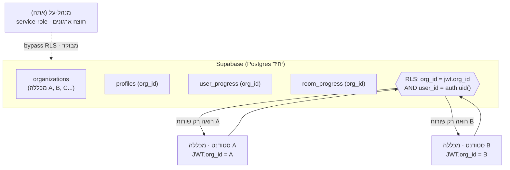
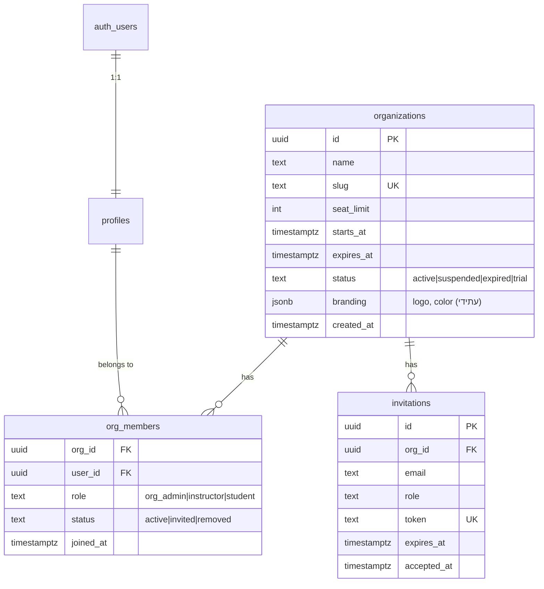
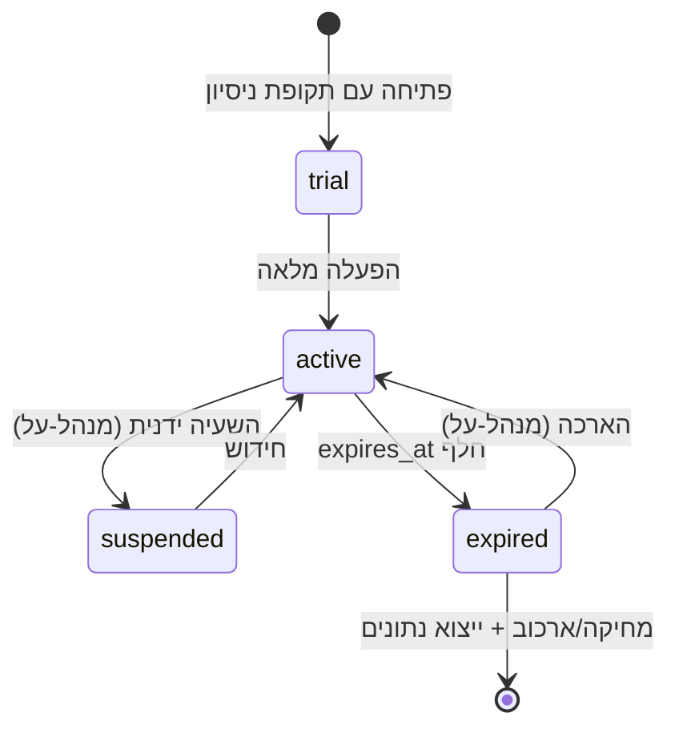
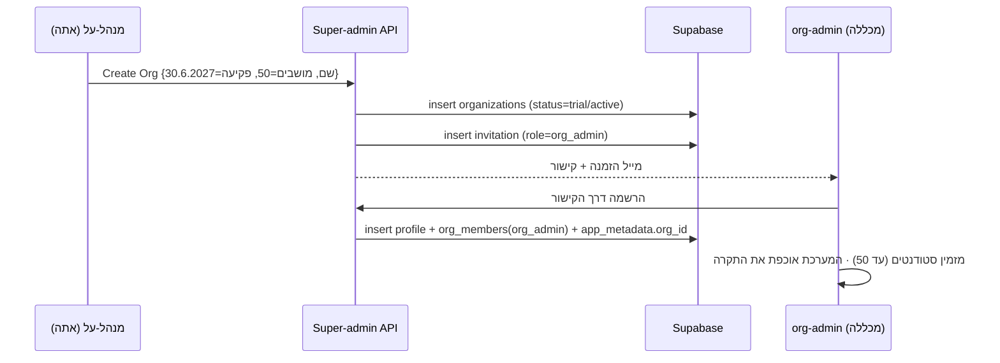

# אפיון טכני מקיף — הפיכת HACK THE SOC למערכת B2B רב-דיירית (Multi-Tenant)

**מטרה:** להכשיר את הפלטפורמה למכירה למכללות המלמדות סייבר, כך שכל מכללה תקבל סביבה עצמאית עם **בידוד מידע מלא** מהמכללות האחרות, ואתה (כמנהל-על) תוכל לפתוח, לתמחר ולנהל את הסביבות מקצה-לקצה — כולל שליטה בכמות המשתמשים ובתאריך התוקף.

- **תאריך:** 04.08.2026
- **סטטוס:** אפיון מקדים (Discovery + Design). טרם מומש קוד. מבוסס על מיפוי מדויק של הקוד הקיים.
- **בסיס טכני קיים:** Next.js 15 (App Router) · Supabase (Postgres + Auth + RLS) · Vercel · Upstash (rate-limit).

> **הערה על שפה:** האפיון בעברית; מונחים טכניים ושמות זהויות (טבלאות/עמודות/פונקציות) באנגלית כדי להישאר צמודים לקוד.

---

## 0. תקציר מנהלים — ההמלצה בקצרה

1. **מודל דיירוּת:** בסיס נתונים אחד משותף (Supabase יחיד) עם **`org_id` על כל טבלה** ובידוד באמצעות **RLS (Row-Level Security) לפי ארגון**, מחוזק בהגנה-לעומק (JWT claim + אכיפת אפליקציה + בדיקות דליפה אוטומטיות). זה המודל התקני והמדרגי ל-Supabase, והוא נותן בידוד לוגי מלא. למכללה שתדרוש בידוד *פיזי* בחוזה — נציע "Dedicated tier" (פרויקט Supabase נפרד) כתוספת תשלום.
2. **ישויות חדשות:** `organizations` (מכללה), `org_members` (חברוּת + תפקיד בארגון), `invitations` (הזמנות/הרשמה), ורישוי (`seat_limit`, `starts_at`, `expires_at`, `status`) על הארגון.
3. **מודל תפקידים:** `platform_super_admin` (אתה, מעל כל הארגונים) · `org_admin` (צוות המכללה) · `instructor` (מרצה) · `student`. ההרשאות הארגוניות יגיעו מ-`org_members.role`, לא מ-`profiles.role` הגלובלי הקיים.
4. **אכיפת רישוי:** מספר מושבים (seats) ותאריך תפוגה נאכפים **בצד השרת** בשלוש נקודות — בעת הרשמה (חסימה מעל התקרה), בעת הנפקת session (Supabase Auth Hook דוחה כניסה אחרי פקיעה/השעיה), ובמשימת רקע לילית שמסמנת ארגונים שפג תוקפם.
5. **ממשק ניהול:** מסך מנהל-על מלא (רשימת ארגונים, אשף פתיחת סביבה, ניהול מושבים/תאריכים, ניהול משתמשים, דוחות שימוש, השעיה/הארכה, audit) + מסך org-admin לכל מכללה לניהול הסטודנטים שלה בלבד. **הממשק הקיים הוא mock ב-localStorage — צריך backend אמיתי בצד השרת.**
6. **מסלול:** 6 שלבים, מ-Foundations (טבלאות ארגון + RLS) ועד הקשחה ומבדק חדירות. Phase 0–1 נותנים כבר סביבה מוכרת-למכירה.

---

## 1. הדרישות (formalized)

| # | דרישה (מהבקשה שלך) | תרגום טכני |
|---|---------------------|-------------|
| R1 | כמה מכללות במקביל | Multi-tenancy — ריבוי ארגונים על אותה מערכת |
| R2 | הן לא חשופות למידע אחת של השנייה, הפרדה כוללת | **בידוד נתונים מלא** — cross-tenant isolation אכיף ובר-הוכחה |
| R3 | אני פותח סביבה, שולט בכמות יוזרים | Provisioning + **seat limit** per org |
| R4 | ולאיזה תאריך | **License window** (start/expiry) per org, נאכף בצד שרת |
| R5 | הממשק פתוח עבורם | Self-service לסטודנטים + org-admin למכללה |
| R6 | מערכת ממשק מקיפה מקצה-לקצה לניהול | Super-admin console + org-admin console |

**דרישות-על נגזרות (לא-פונקציונליות):**
- **Least privilege** — כל שאילתה, כל endpoint וכל מדיניות RLS מוגבלים לארגון של הקורא.
- **Defense in depth** — אף שכבה בודדת לא היחידה שמונעת דליפה חוצת-ארגונים.
- **Auditability** — כל פעולה ניהולית (פתיחת ארגון, הוספת/הסרת משתמש, שינוי מושבים/תאריך) מתועדת עם `org_id`.
- **Privacy/רגולציה** — כל מכללה היא בעל-מאגר; אתה מעבד. נדרש DPA, מדיניות שמירה/מחיקה, והמשכיות מול תקנות הגנת הפרטיות (אבטחת מידע) התשע"ז-2017 + תיקון 13 (בהמשך לסבב האבטחה שכבר בוצע).

---

## 2. המצב הקיים — נקודת הפתיחה (מבוסס מיפוי קוד)

היום המערכת היא **single-tenant**: כל המשתמשים חיים במרחב גלובלי אחד.

**מה שקיים וטוב (בסיס חזק לבנות עליו):**
- Supabase Auth עם אימות JWT אמיתי (`getUser()`, לא `getSession()`) בכל שכבה — middleware, apiGuard, RLS.
- RLS מופעל על כל הטבלאות הפר-משתמשיות עם הצורה `auth.uid() = user_id`.
- Middleware שמגן על routes (`default-deny` ל-`/api/*`, gating לעמודים, `/admin` דורש `role='admin'`).
- טריגר הרשמה (`handle_new_user()`) שמזריק פרופיל ו-`user_progress`, עם re-validation server-side.
- Facade אחסון מופשט (`src/lib/storage/`) שכבר יודע להחליף backend (localStorage ↔ Supabase).

**הפערים החוסמים B2B (כל אחד מהם חייב טיפול):**

| # | פער | היכן | ההשלכה |
|---|-----|------|---------|
| G1 | **אין מימד ארגון בשום מקום** | כל הטבלאות | אין הפרדה בין מכללות |
| G2 | כל RLS = `auth.uid() = user_id` | `0002:114-116`, `0004`, `0005` | הבידוד היום הוא בין *משתמשים*, לא בין *ארגונים* |
| G3 | `profiles.role` הוא תפקיד **גלובלי** יחיד | `0001:16` | אין org-admin, אין הרשאה מוגבלת-לארגון |
| G4 | `handle` ייחודי **גלובלית** | `0001:13` | שתי מכללות לא יוכלו להחזיק אותו כינוי |
| G5 | **ממשק הניהול הוא mock ב-localStorage** — 6 משתמשי דמה, לא מחובר ל-`profiles`/`auth.users` | `admin/page.tsx:229-337` | אין ניהול משתמשים אמיתי; חייב backend חדש |
| G6 | תוכן הלימוד (חדרים/תרחישים/חברות) הוא **קוד סטטי** ב-`src/data/*` | `rooms.ts`, `sim/*` | משותף לכולם; אין דרך לשייך/להתאים תוכן פר-מכללה |
| G7 | אין רישוי, מושבים או תפוגה | — | אין מודל מכירה |
| G8 | מצב guest (Supabase לא מוגדר) עוקף את שער ה-API | `middleware.ts:80` | ב-SaaS מתארח יש לבטל/להפוך את ברירת המחדל |
| G9 | טבלאות ספקולטיביות מ-`0001` שאינן בשימוש האפליקציה | `0001` | attack surface מיותר — מומלץ למחוק |

> **מסקנה:** הבסיס (Auth + RLS + Facade) איכותי. העבודה היא **הוספת מימד `org_id` עקבי בכל שכבה**, ובניית שכבת ניהול/רישוי אמיתית בצד השרת.

---

## 3. מודל ה-Multi-Tenancy — ניתוח והחלטה

יש שלוש גישות קלאסיות. להלן השוואה בהקשר Supabase והדרישה שלך ל"הפרדה כוללת":

| גישה | בידוד | תפעול/עלות | התאמה ל-Supabase | תוכן גלובלי משותף | פסק דין |
|------|-------|------------|-------------------|---------------------|----------|
| **A. Shared DB + RLS by `org_id`** (schema אחד, עמודת ארגון) | לוגי חזק (RLS + הגנה-לעומק) | נמוכה — DB אחד, migration אחד | **מצוין** — RLS הוא לב Supabase | קל (עמודת `org_id` nullable) | ✅ **מומלץ** |
| B. Schema-per-tenant (סכימה נפרדת לכל מכללה) | חזק יותר | בינונית-גבוהה — N סכימות, migration כפול-N | חלש — Supabase לא מיועד לכך, PostgREST/RLS מסתבכים | קשה | ❌ לא מדרגי |
| C. Database/Project-per-tenant (Supabase נפרד לכל מכללה) | פיזי מלא | גבוהה מאוד — N פרויקטים, N deployments | יקר, ניהול ידני | קשה מאוד | ⚠️ רק כ-Tier יוקרתי |

### ההחלטה: **גישה A — Shared DB + RLS by org, עם הגנה-לעומק**

זה הסטנדרט התעשייתי ל-SaaS רב-דיירי על Postgres/Supabase, והוא נותן בידוד לוגי מלא כשמיישמים אותו **בשכבות**:

1. **עמודת `org_id NOT NULL`** על כל טבלה פר-דייר (כולל `profiles`).
2. **RLS לפי ארגון** — כל מדיניות נכתבת מחדש כך שתדרוש גם התאמת `org_id` (דרך claim ב-JWT), ולא רק `user_id`.
3. **`org_id` ב-JWT** — נזרק ב-`app_metadata` (נשלט-שרת, המשתמש לא יכול לשנותו) או דרך **Custom Access Token Hook**. RLS קורא אותו: `(auth.jwt() -> 'app_metadata' ->> 'org_id')::uuid`.
4. **אכיפת אפליקציה** — כל query בקוד מסנן גם ל-`org_id` (גם אם RLS כבר מגן — belt & suspenders).
5. **מפתחות זרים מרוכבים (composite FK)** — ילד חייב לשתף `org_id` עם ההורה שלו, כדי שאי-אפשר יהיה "לתפור" רשומה של ארגון א' תחת ארגון ב'.
6. **בדיקות דליפה אוטומטיות ב-CI** — טסטים שמנסים לקרוא נתוני ארגון אחר ומוודאים שהם *נכשלים*.

> **"הפרדה כוללת" (R2):** מושגת ע"י כך ש-RLS (ברמת ה-DB, לא ניתן לעקיפה מהדפדפן) חוסם כל שורה שה-`org_id` שלה ≠ הארגון ב-JWT. גם אם קוד אפליקציה יכתוב שאילתה שגויה — ה-DB עצמו מסרב להחזיר את השורות. זו נקודת האמת.

### מודל דיירוּת חזותי



---

## 4. בידוד נתונים — אסטרטגיית ההפרדה המלאה (R2)

שכבות ההגנה, מהחזקה (DB) לחיצונית (בדיקות):

**שכבה 1 — RLS ברמת שורה (הבסיס).** לכל טבלה פר-דייר, המדיניות נכתבת מחדש:

```sql
-- דוגמה: room_progress (מחליף את "room_progress own select/write" מ-0002)
create policy "room_progress org isolation"
  on public.room_progress for all
  using (
    org_id = (auth.jwt() -> 'app_metadata' ->> 'org_id')::uuid
    and user_id = auth.uid()
  )
  with check (
    org_id = (auth.jwt() -> 'app_metadata' ->> 'org_id')::uuid
    and user_id = auth.uid()
  );
```

- סטודנט רואה רק שורות *של עצמו בתוך הארגון שלו*.
- org-admin/instructor יקבלו policy נפרדת שמתירה קריאה של **כל** שורות הארגון (`org_id = jwt.org_id` בלי `user_id`), אך ורק אם `jwt.role in ('org_admin','instructor')`.

**שכבה 2 — `org_id` ב-JWT, נשלט-שרת.** ה-`org_id` (וה-`org_role`) נכתבים ב-`app_metadata` של המשתמש בעת ההרשמה/שיוך, דרך פונקציית שרת (service-role). המשתמש **אינו** יכול לשנות `app_metadata`. אם משתמש שייך ליותר מארגון אחד (נדיר — מרצה חוצה-מכללות), נשתמש ב-Custom Access Token Hook שמזריק את ה-"active org" לפי בחירה בזמן login.

**שכבה 3 — אכיפת אפליקציה.** ה-Facade (`remoteBackend.ts`) והנתיבים יסננו תמיד `.eq("org_id", currentOrgId)` בנוסף ל-RLS. מקור ה-`currentOrgId` הוא ה-JWT (server) / ה-session (client), לעולם לא קלט משתמש.

**שכבה 4 — שלמות היררכית (composite FK).** למשל `dashboard_sessions(org_id, user_id)` עם FK מרוכב `(org_id, user_id) → profiles(org_id, id)`, כדי למנוע רשומת-בת ששוברת גבול ארגון.

**שכבה 5 — בדיקות דליפה ב-CI.** חבילת טסטים ייעודית: מתחזה למשתמש של ארגון A, מנסה `select`/`update` על מזהי-שורה של ארגון B, ומוודאת **0 שורות / דחייה**. רץ בכל PR (מצטרף לשערי-התוכן הקיימים).

**שכבה 6 (אופציונלי, ל-Tier יוקרתי) — בידוד פיזי.** מכללה שתדרוש בחוזה DB נפרד → פרויקט Supabase ייעודי + deployment נפרד. אותו קוד, config שונה.

### הוכחת בידוד — מטריצת בקרות

| וקטור התקפה | הבקרה שחוסמת |
|--------------|--------------|
| קוד אפליקציה שוכח לסנן `org_id` | RLS (שכבה 1) — ה-DB מסרב |
| משתמש מזייף `org_id` בבקשה | ה-`org_id` מגיע מ-JWT חתום, לא מקלט (שכבה 2) |
| RLS נשכח על טבלה חדשה | טסט דליפה ב-CI נכשל (שכבה 5) + checklist ב-migration |
| תפירת רשומת-בת חוצת-ארגון | composite FK (שכבה 4) |
| org-admin מנסה לראות ארגון אחר | ה-policy שלו קשור ל-`jwt.org_id` בלבד (שכבה 1) |
| service-role דולף לדפדפן | לעולם לא נשלח ל-client; שרת-בלבד (קיים כבר, `admin.ts`) |

---

## 5. מודל הישויות וההרשאות

### ישויות חדשות



### מודל התפקידים (RBAC)

| תפקיד | היכן מאוחסן | היקף | יכולות עיקריות |
|-------|-------------|------|-----------------|
| **platform_super_admin** (אתה) | `profiles.is_platform_admin=true` (או טבלת `platform_admins`) | חוצה כל הארגונים | פתיחת/סגירת ארגונים, קביעת מושבים+תאריכים, השעיה, חיוב, דוחות-על, ניהול כל המשתמשים |
| **org_admin** (צוות המכללה) | `org_members.role='org_admin'` | ארגון בודד | ניהול הסטודנטים של המכללה (הזמנה/הסרה עד תקרת המושבים), צפייה בהתקדמות הקבוצה, שיוך תוכן/מסלול |
| **instructor** (מרצה) | `org_members.role='instructor'` | ארגון בודד | צפייה בהתקדמות הסטודנטים שלו, בלי ניהול מושבים/רישוי |
| **student** | `org_members.role='student'` | עצמו, בתוך הארגון | לומד/מתרגל; רואה רק את הנתונים של עצמו |

> **החלטת עיצוב:** `profiles.role` הגלובלי הקיים (analyst/…/admin) **מוחלף** לצורכי הרשאה ע"י `org_members.role`. את דרגת-הלמידה (analyst/senior/hunter) אפשר להשאיר כשדה גיימיפיקציה נפרד או למפות ל-rank הקיים. `is_platform_admin` הוא דגל נפרד — מנהל-על אינו "עוד תפקיד בארגון".

### מטריצת הרשאות (תמצית)

| פעולה | super_admin | org_admin | instructor | student |
|-------|:-----------:|:---------:|:----------:|:-------:|
| פתיחת/מחיקת ארגון | ✅ | — | — | — |
| קביעת מושבים + תאריך תוקף | ✅ | — | — | — |
| השעיה/הארכת רישיון | ✅ | — | — | — |
| הזמנת/הסרת סטודנט (עד התקרה) | ✅ | ✅ (הארגון שלו) | — | — |
| צפייה בהתקדמות כל הארגון | ✅ | ✅ | ✅ | — |
| צפייה בנתוני ארגון אחר | ✅ | — | — | — |
| למידה/תרגול + תעודות | ✅ | ✅ | ✅ | ✅ |
| דוחות-על חוצי-ארגונים / חיוב | ✅ | — | — | — |

---

## 6. רישוי, מושבים ותפוגה (R3 + R4)

מודל הרישוי יושב על `organizations`: `seat_limit`, `starts_at`, `expires_at`, `status`.

### אכיפה — שלוש נקודות בצד השרת

**נקודה 1 — בעת הרשמה/שיוך (seat cap):** לפני יצירת `org_members` חדש, פונקציית שרת סופרת חברים פעילים; אם `count >= seat_limit` → נדחה עם "המכללה הגיעה למכסת המשתמשים". אטומי (ב-transaction / SECURITY DEFINER function) כדי למנוע מרוץ.

**נקודה 2 — בעת הנפקת session (תוקף):** **Supabase Auth Hook (Custom Access Token / Before-User-Created)** בודק את סטטוס הארגון של המשתמש. אם `status != 'active'` או `now() > expires_at` → הכניסה נדחית / ה-token לא מונפק. זו נקודת האכיפה החזקה: משתמש של רישיון שפג פשוט לא נכנס.

**נקודה 3 — Middleware (גיבוי + חוויית משתמש):** בדיקת סטטוס הארגון בכל ניווט; אם פג/מושעה → הפניה לעמוד "רישיון פג — פנה למנהל המכללה" במקום שגיאה גולמית.

**משימת רקע לילית (Scheduled Task / cron):** סורקת ארגונים, מסמנת `expires_at < now()` כ-`expired`, ושולחת התראה יזומה X ימים לפני פקיעה (למנהל-העל ולמנהל המכללה).

### מצבי רישיון



- **Grace period (מומלץ):** אחרי פקיעה, חלון של X ימים לקריאה-בלבד לפני חסימה מלאה — נותן זמן לחידוש בלי לאבד גישה חד-פעמית.
- **מחיקה בתום החוזה:** בעת סגירת ארגון — ייצוא נתוני המכללה (CSV/JSON) ואז מחיקה קשה, בהתאם למדיניות שמירה (ר' §13).

---

## 7. הצטרפות משתמשים (Onboarding / Enrollment) — R5

איך סטודנטים נכנסים לסביבה של המכללה שלהם? שלוש שיטות, מומלץ לתמוך בשילוב:

| שיטה | איך זה עובד | מתי מתאים |
|------|-------------|-----------|
| **A. קוד/קישור הזמנה לכיתה** | org-admin מייצר קישור הרשמה ייחודי לארגון; הנרשם דרכו משויך אוטומטית ל-`org_id` הנכון | הכי פשוט; כיתה/קורס |
| **B. Allowlist לפי דומיין מייל** | הרשמה עם מייל `@college.ac.il` משייכת אוטומטית לארגון | מכללה עם דומיין אחיד |
| **C. העלאת רשימה (CSV roster)** | org-admin מעלה רשימת מיילים; המערכת שולחת הזמנות (`invitations`) | קבוצה גדולה מראש |

**נקודות קריטיות:**
- ה-`org_id` בהרשמה **נקבע ע"י ההזמנה/הדומיין** (server-side), **לעולם לא ע"י קלט המשתמש** — אחרת משתמש יבחר ארגון זר.
- `handle_new_user()` (הטריגר הקיים) יורחב לקרוא `org_id` + `org_role` מההזמנה, ולאכלס `org_members` + `app_metadata.org_id`.
- **ייחודיות `handle` הופכת לפר-ארגון** — האינדקס משתנה מ-`unique(handle)` ל-`unique(org_id, handle)`; `handle_available()` יקבל פרמטר `org_id`.
- אכיפת seat-cap (§6 נקודה 1) מופעלת כאן.

---

## 8. ממשק הניהול מקצה-לקצה (R6)

> **תזכורת קריטית:** הממשק הקיים (`admin/page.tsx`) הוא **mock ב-localStorage** — 6 משתמשי דמה, לא מחובר ל-DB. צריך לבנות **backend ניהול אמיתי** (טבלאות + `/api/superadmin/*` + `/api/org/*` עם service-role וגייטים `requireSuperAdmin`/`requireOrgAdmin`).

### 8א. קונסולת מנהל-על (אתה) — `/superadmin`

| מסך | תוכן / פעולות |
|-----|----------------|
| **Organizations (רשימה)** | טבלת כל המכללות: שם, מושבים בשימוש/סה"כ, חלון רישיון, סטטוס (צבע), שימוש אחרון. חיפוש/סינון/מיון. |
| **Create Organization (אשף)** | שם + slug · **תקרת מושבים** · **תאריך התחלה + תאריך פקיעה** · פרטי איש-קשר (org-admin ראשון) → יוצר ארגון + שולח הזמנת org-admin |
| **Organization detail** | טאבים: **Members** (רשימה, הוספה/הסרה, שינוי תפקיד, מצב מושבים X/Y) · **License** (עריכת מושבים/תאריכים, השעיה, הארכה) · **Usage** (משתמשים פעילים, XP מצטבר, sessions, השלמות — גרפים) · **Content** (שיוך מסלולים/חדרים — עתידי) · **Audit** (יומן פעולות הארגון) |
| **Global usage** | דשבורד חוצה-ארגונים: סה"כ מכללות פעילות, משתמשים, ניצול מושבים, ארגונים שמתקרבים לפקיעה, עלות LLM לפי ארגון |
| **Billing (עתידי)** | תמחור לפי מושבים/תקופה, חשבוניות |

### 8ב. קונסולת org-admin (צוות המכללה) — `/manage`

מוגבל לארגון של המנהל בלבד (RLS + גייט):
- **Students** — רשימת הסטודנטים של המכללה, הזמנה (עד תקרת המושבים), הסרה, איפוס.
- **Cohort progress** — התקדמות הקבוצה: מי התחיל, XP, דרגות, חדרים שהושלמו, תעודות שהונפקו.
- **Enrollment** — יצירת קישור/קוד הזמנה, העלאת CSV.
- **(עתידי)** שיוך מסלול/תוכן, מיתוג המכללה.

מנהל המכללה **לא** רואה רישוי/חיוב (זה שלך) ולא ארגונים אחרים.

### 8ג. זרימת פתיחת סביבה (מנהל-על)



---

## 9. הממשק לסטודנטים / מכללות (R5)

עבור הסטודנט, החוויה כמעט זהה להיום — הוא נכנס ולומד — אך:
- כל הנתונים שלו מתויגים אוטומטית ל-`org_id` של המכללה (שקוף לו).
- אין לו שום נראוּת לארגונים אחרים.
- **(עתידי, Phase 4)** מיתוג קל של המכללה — לוגו/צבע בראש המסך (`organizations.branding`), עמוד נחיתה ייעודי לכל מכללה (`app.hackthesoc.com/college-slug`).
- התעודות (הפיצ'ר שבנינו) יכולות לשאת גם את שם המכללה — ערך מכירה נוסף.

---

## 10. שינויי סכמה (Schema) — קונקרטי

### 10א. טבלאות חדשות (migration `0010_multitenancy.sql`)

```sql
create table public.organizations (
  id          uuid primary key default gen_random_uuid(),
  name        text not null,
  slug        text not null unique,
  seat_limit  integer not null default 0,
  starts_at   timestamptz,
  expires_at  timestamptz,
  status      text not null default 'trial'
              check (status in ('trial','active','suspended','expired')),
  branding    jsonb default '{}'::jsonb,
  created_at  timestamptz not null default now()
);

create table public.org_members (
  org_id    uuid not null references public.organizations(id) on delete cascade,
  user_id   uuid not null references auth.users(id) on delete cascade,
  role      text not null default 'student'
            check (role in ('org_admin','instructor','student')),
  status    text not null default 'active'
            check (status in ('active','invited','removed')),
  joined_at timestamptz not null default now(),
  primary key (org_id, user_id)
);

create table public.invitations (
  id         uuid primary key default gen_random_uuid(),
  org_id     uuid not null references public.organizations(id) on delete cascade,
  email      text not null,
  role       text not null default 'student',
  token      text not null unique,
  expires_at timestamptz not null,
  accepted_at timestamptz
);
-- + דגל platform admin:
alter table public.profiles add column is_platform_admin boolean not null default false;
```

### 10ב. הוספת `org_id` לטבלאות הקיימות (פר-דייר)

מוסיפים `org_id uuid references organizations(id)` ל־: `profiles`, `user_progress`, `room_progress`, `dashboard_sessions`, `scenario_history`, `ai_usage`, `audit_log`.

**מסלול backfill בטוח (3 צעדים, כדי לא לשבור נתונים קיימים):**
1. `add column org_id uuid` (nullable) + יצירת ארגון "Internal / Default" ושיוך כל המשתמשים הקיימים (אתה + בדיקות) אליו.
2. אינדקסים: `create index on <t> (org_id, user_id)` לכל טבלה (חיוני ל-performance של RLS).
3. `alter column org_id set not null` אחרי ה-backfill, ואז החלפת מדיניות ה-RLS (§4 שכבה 1).

### 10ג. RLS — כתיבה מחדש

כל מדיניות `"<t> own …"` מוחלפת ב-`"<t> org isolation"` (הדפוס ב-§4). בנוסף, policies נפרדות ל-org_admin/instructor לקריאת כלל-הארגון. ל-`audit_log` — נשאר deny-all-client (service-role בלבד), אך מקבל `org_id` לסינון בקונסולה.

### 10ד. ניקוי חוב (מומלץ)

הטבלאות הספקולטיביות מ-`0001` שאינן בשימוש (`learning_paths`, `modules`, `lessons`, `lesson_progress`, `scenario_runs`, `alerts`, `telemetry_events`, `investigations`, `investigation_notes`, `hunts`, `detections`, `badges`, `user_badges`, `xp_events`, `ai_conversations`, `ai_messages`) — **למחוק** (`drop table`) כדי לצמצם attack surface לפני מבדק חדירות. הן נושאות RLS ותחזוקה ללא תועלת. (החלטה — ר' §16.)

---

## 11. שינויי Authentication

- **`org_id` + `org_role` ב-JWT:** דרך `app_metadata` (נכתב ע"י service-role בעת שיוך). RLS ו-middleware קוראים משם.
- **`handle_new_user()`** (הטריגר הקיים, `0009`) מורחב: קורא `org_id`/`org_role`/`invitation_token` מ-`raw_user_meta_data`, מאמת מול `invitations`, מאכלס `org_members` + כותב `app_metadata.org_id`, ואוכף seat-cap. `handle` הופך ל-unique-per-org.
- **`requireAdmin` → `requireSuperAdmin` + `requireOrgRole(org_id, roles[])`:** ה-apiGuard הקיים (`apiGuard.ts`) מתרחב: `requireSuperAdmin` בודק `is_platform_admin`; `requireOrgAdmin` בודק חברוּת + תפקיד בארגון הרלוונטי. שניהם fail-closed, עם audit (כמו היום).
- **Middleware:** מוסיף "org resolution" — מזהה את הארגון מה-JWT, בודק סטטוס רישיון (§6 נקודה 3), ומוסיף `/superadmin` ל-ADMIN_PREFIXES (דורש `is_platform_admin`).
- **Auth Hook לתוקף:** אכיפת פקיעה/השעיה בהנפקת token (§6 נקודה 2).
- **מצב guest (G8):** ב-SaaS מתארח — לבטל את ה-fallback או להפוך את ברירת המחדל ל"סגור", כדי שלא תהיה גישה ללא ארגון.

---

## 12. תוכן: גלובלי מול פר-מכללה

היום כל התוכן (חדרים/תרחישים/חברות/חידונים) הוא **קוד סטטי משותף** (`src/data/*`, `src/lib/sim/*`). זה בסדר לשלב ראשון — כל המכללות מקבלות את אותו קטלוג איכותי. **הרחבה עתידית (Phase 4):**
- הוספת `org_id` **nullable** לתוכן (null = גלובלי/משותף; ערך = בלעדי למכללה).
- ה-loaders ימזגו `global + tenant` — כל מכללה רואה את הקטלוג המשותף + תוכן משלה.
- העברת תוכן שנוצר ב-AI וה-admin-state מ-localStorage (G5, `ADMIN_KEYS`) לטבלת תוכן org-scoped — דרוש בכל מקרה כדי שניהול התוכן יהיה רב-מכשירי ורב-דיירי.
- אפשרות למכללה: לבחור אילו מסלולים/חדרים פעילים לסטודנטים שלה (assignment).

---

## 13. אבטחת מידע ופרטיות

**המשך ישיר לסבב האבטחה שכבר בוצע** (RLS, security headers, audit, rate-limit, CSP). תוספות ל-B2B:

**טכני:**
- בדיקות דליפה חוצת-ארגונים ב-CI (§4 שכבה 5) — תנאי-סף לפני מכירה.
- אינדקסים על `org_id` + בחינת ביצועי RLS תחת עומס רב-דיירי.
- rate-limit **פר-ארגון** (בנוסף ל-per-IP הקיים) — כדי שמכללה אחת לא תרוקן תקציב LLM של אחרת.
- ייצוא + מחיקה קשה פר-ארגון (offboarding).
- מבדק חדירות עם דגש על tenant-isolation לפני go-live מסחרי.

**רגולציה/פרטיות (ישראל):**
- **כל מכללה = בעל-מאגר (Controller); אתה = מחזיק/מעבד (Processor).** נדרש **DPA** (Data Processing Agreement) מול כל מכללה.
- **תת-מעבדים (sub-processors):** Supabase, Vercel, Upstash, ו-Anthropic/OpenAI (פיצ'רי ה-AI) — לפרט ולקבל הסכמה. שים לב: נתוני סטודנטים שעוברים ל-LLM — לחשוף במפורש; ייתכן שמכללה תדרוש לכבות פיצ'רי AI.
- **שמירה ומחיקה:** מדיניות retention מוגדרת; מחיקה בתום החוזה; זכות עיון/מחיקה של נדרש (data subject).
- **המשכיות מול** תקנות הגנת הפרטיות (אבטחת מידע) התשע"ז-2017 + תיקון 13, ורמת האבטחה של המאגר (בינונית/גבוהה — לקבוע לפי היקף).
- ייעוץ משפטי/DPO לסגירת ה-DPA וההגדרות — מומלץ לפני החתמת מכללה ראשונה.

---

## 14. תשתית ותפעול

- **Supabase scaling:** connection pooling (Supavisor) לריבוי סטודנטים במקביל; ניטור מגבלות תוכנית; אינדקסי `org_id`.
- **סביבות:** Staging נפרד מ-Production (מכירה מחייבת יציבות). CI הקיים מתרחב עם טסטי הדליפה.
- **גיבוי/שחזור:** PITR של Supabase; נוהל שחזור פר-ארגון.
- **Observability:** דוחות שימוש פר-ארגון (כבר בקונסולה) + התראות (פקיעת רישיון, חריגת מושבים, חריגת עלות LLM).
- **Dedicated tier (אופציונלי):** פרויקט Supabase נפרד למכללה שדורשת בידוד פיזי — אותו קוד, config שונה.
- **ה-secrets הפתוחים מהמוכנות-לפרודקשן** (`SUPABASE_SERVICE_ROLE_KEY`, Upstash) — הופכים לחובה (לא אופציונליים) ב-SaaS מסחרי.

---

## 15. מסלול יישום מדורג (Roadmap)

| שלב | תוכן | תוצר | גודל |
|-----|------|------|------|
| **Phase 0 — Foundations** | טבלאות `organizations`/`org_members`/`invitations`; `org_id` + backfill לארגון Default; אינדקסים; כתיבת RLS מחדש; JWT org claim; טסטי דליפה | בידוד מלא ברמת ה-DB | **L** |
| **Phase 1 — Super-admin + Provisioning** | `/superadmin` (רשימה + אשף פתיחה), `/api/superadmin/*`, seat-cap + license window + אכיפת תוקף (Auth Hook + cron) | **כבר אפשר לפתוח ולמכור סביבה** | **L** |
| **Phase 2 — Enrollment** | קישורי הזמנה / domain allowlist / CSV; `handle_new_user` מורחב; handle unique-per-org | סטודנטים נכנסים לבד | **M** |
| **Phase 3 — Org-admin console** | `/manage` למכללה: ניהול סטודנטים + התקדמות קבוצה + דוחות שימוש | המכללה מנהלת את עצמה | **M** |
| **Phase 4 — Per-tenant content & branding** | תוכן org-scoped, assignment, מיתוג, תעודה עם שם מכללה | בידול/upsell | **M-L** |
| **Phase 5 — Hardening** | rate-limit פר-ארגון, ייצוא/מחיקה, DPA, מבדק חדירות tenant-isolation, ניקוי טבלאות `0001` | מוכן מסחרית | **M** |

> **מינימום מוצר מכיר (MVP למכירה):** Phase 0 + 1 + 2. עם אלה יש בידוד מלא, פתיחת סביבה עם מושבים+תוקף, וכניסת סטודנטים.

---

## 16. סיכונים והחלטות שקבעתי כברירת מחדל

קבעתי ברירות-מחדל סבירות כדי לא לעצור את האפיון. סמן לי אם תרצה לשנות אחת מהן:

1. **בידוד לוגי (RLS) כברירת מחדל, בידוד פיזי כ-Tier יוקרתי** — ולא DB נפרד לכל מכללה מהיום הראשון. (המלצה חד-משמעית ל-Supabase.)
2. **משתמש שייך לארגון אחד** — פשוט ומתאים למכללות. `org_members` כבר תומך בעתיד בריבוי (מרצה חוצה-מכללות) דרך "active org" ב-token.
3. **המכללה מנהלת את הסטודנטים שלה בעצמה** (org-admin), ואתה מנהל-על מעל כולם — ולא שאתה מנהל ידנית כל סטודנט.
4. **התאמת תוכן/מיתוג פר-מכללה — שלב מאוחר (Phase 4)**; בהתחלה כל המכללות מקבלות את אותו קטלוג.
5. **מחיקת הטבלאות הספקולטיביות מ-`0001`** שאינן בשימוש — לצמצום attack surface. (אם יש כוונה עתידית להשתמש בהן, נשאיר.)
6. **מצב guest/localStorage — לבטל ב-SaaS מתארח.** (אם תרצה להשאיר "demo mode" ציבורי, זו החלטה נפרדת.)

**סיכונים מרכזיים:** (א) דליפה חוצת-ארגון עקב טבלה/policy שנשכחה — מנוטרל ע"י טסטי CI וה-checklist; (ב) ביצועי RLS תחת עומס — מנוטרל ע"י אינדקסי `org_id`; (ג) מורכבות ה-Auth Hook לתוקף — לבדוק היטב ב-Staging; (ד) חוב ה-admin ב-localStorage — דורש בנייה-מחדש בצד שרת (מתומחר ב-Phase 1/3).

---

## נספח א' — טבלאות שמקבלות `org_id` (רשימה מלאה)

בשימוש האפליקציה (חובה): `profiles`, `user_progress`, `room_progress`, `dashboard_sessions`, `scenario_history`, `ai_usage`, `audit_log`.
חדשות: `organizations`, `org_members`, `invitations`.
תוכן (Phase 4, `org_id` nullable): טבלת תוכן org-scoped שתחליף את `ADMIN_KEYS` שב-localStorage.

## נספח ב' — נקודות בקוד לגעת בהן (מהמיפוי)

- RLS: `0002:105-119`, `0004`, `0005:47-51` → migration `0010`.
- Auth: `handle_new_user()` (`0009:20-73`), `apiGuard.ts:62-73`, `middleware.ts`, `supabase/middleware.ts:41-117`.
- Facade: `remoteBackend.ts:53-219` (הוספת `.eq("org_id", …)`), `keys.ts`.
- Admin: `admin/page.tsx` (בנייה-מחדש server-backed), `/api/admin/*`.
- תוכן גלובלי: `src/data/rooms.ts`, `src/lib/sim/*` (loaders ממזגים global+tenant ב-Phase 4).

---

*אפיון זה הוא בסיס לתכנון. השלב הבא המומלץ: אישור ההחלטות ב-§16, ואז תכנון מפורט של Phase 0 (migration `0010` + RLS + טסטי דליפה) כמנת-עבודה ראשונה.*
