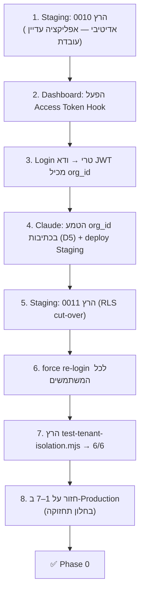

# Phase 0 — Multi-Tenancy Foundations — תוכנית יישום מקצה-לקצה

**מטרת Phase 0:** להטמיע את שכבת הבידוד הרב-דיירית ברמת בסיס-הנתונים, כך שנתוני כל מכללה מבודדים מלאה ברמת ה-DB (RLS לפי ארגון), **בלי לשבור את האפליקציה הקיימת** תוך כדי המעבר. בסוף Phase 0 יש: מודל ארגונים, `org_id` על כל טבלה, בידוד נאכף-DB, ו-**טסט קבלה שמוכיח שאין דליפה**.

- **קדם ל:** Phase 1 (קונסולת מנהל-על + provisioning + אכיפת רישוי).
- **מסמך אב:** [b2b-multitenancy-spec.md](b2b-multitenancy-spec.md) (האפיון המלא).
- **אילוץ ביצוע:** Claude **לא** יכול להריץ migrations. הקבצים מסופקים להרצה ע"י Tal (SQL editor / `supabase db push`). כל שינויי ה-SQL עוברים **קודם ב-Staging**.

---

## 1. Definition of Done (מתי Phase 0 גמור)

- [ ] טבלאות `organizations` / `org_members` / `invitations` קיימות; קיים ארגון "Internal / Default"; Tal מסומן `is_platform_admin`.
- [ ] לכל טבלה פר-דייר יש `org_id NOT NULL`, כל השורות הקיימות משויכות לארגון ה-Default, ויש אינדקסים על `org_id`.
- [ ] ה-Custom Access Token Hook פעיל; login טרי מחזיר JWT עם `org_id`.
- [ ] כל מדיניות RLS מבודדת לפי ארגון (self + org-staff), ולא עוד `auth.uid()=user_id` בלבד.
- [ ] `handle` ייחודי פר-ארגון; המשתמש לא יכול לשנות `org_id`/`role`/`is_platform_admin` של עצמו.
- [ ] האפליקציה כותבת `org_id` בכל insert (מ-session), וממשיכה לעבוד מקצה-לקצה.
- [ ] **`node scripts/test-tenant-isolation.mjs` עובר** מול Staging (6/6 checks).
- [ ] `tsc` + `next build` נקיים; deploy Ready.

---

## 2. תוצרי Phase 0 (Deliverables)

| # | תוצר | קובץ | מי מריץ |
|---|------|------|---------|
| D1 | Migration אדיטיבי (טבלאות, org_id, backfill, hook, trigger) | `supabase/migrations/0010_multitenancy_foundations.sql` | Tal (SQL) |
| D2 | Migration RLS cut-over | `supabase/migrations/0011_multitenancy_rls.sql` | Tal (SQL) |
| D3 | הפעלת ה-Access Token Hook | Supabase Dashboard | Tal |
| D4 | טסט בידוד (acceptance) | `scripts/test-tenant-isolation.mjs` | Claude כתב · Tal/CI מריץ |
| D5 | שינויי אפליקציה (org_id בכתיבות, apiGuard) | קוד (ר' §4) | Claude — **אחרי** D1 |
| D6 | תוכנית זו | `docs/phase-0-plan.md` | — |

> **D1–D2 כבר נכתבו ומוכנים לסקירה.** D5 מיושם ע"י Claude מיד אחרי ש-D1 חי ב-Staging (כי הקוד מפנה ל-`org_id` שנוצר שם).

---

## 3. Runbook — סדר ההרצה הבטוח (מקצה-לקצה)

הסדר קריטי: המעבר האדיטיבי (0010) קודם, אימות ה-claim, ורק אז ה-RLS cut-over (0011). כך אף רגע אין "RLS פעיל בלי claim".

**פירוט הצעדים:**

**צעד 1 — 0010 ב-Staging.** הרץ את `0010_...foundations.sql`. אדיטיבי: מוסיף טבלאות/עמודות/backfill/hook-function/trigger, **בלי לגעת ב-RLS**. האפליקציה ממשיכה לעבוד על ה-RLS הישן. אמת עם שאילתות ה-Verify שבתחתית הקובץ (0 שורות `org_id is null`, Tal = platform admin).

**צעד 2 — הפעלת ה-Hook.** ב-Supabase Dashboard: **Authentication ▸ Hooks ▸ Custom Access Token** → בחר את `public.custom_access_token_hook` → Enable. (חלופה: `supabase/config.toml` → `[auth.hook.custom_access_token] enabled=true, uri="pg-functions://postgres/public/custom_access_token_hook"`.)

**צעד 3 — אימות ה-claim.** התנתק והתחבר מחדש. הרץ (כמשתמש מחובר) `select auth.jwt() ->> 'org_id';` → צריך להחזיר את uuid של ארגון ה-Default. **אם ריק — אל תמשיך ל-0011.** (בדוק שה-hook מופעל ושה-grants עברו.)

**צעד 4 — הטמעת org_id בכתיבות (D5) + deploy.** Claude מטמיע את שינויי §4 (ה-Facade כותב `org_id` מה-session). Deploy ל-Staging. עכשיו כל כתיבה חדשה נושאת org_id מפורש (לא רק ה-default).

**צעד 5 — 0011 ב-Staging (cut-over).** הרץ את `0011_...rls.sql`. מחליף את כל מדיניות ה-RLS לבידוד-ארגון. מרגע זה הבידוד נאכף ב-DB.

**צעד 6 — force re-login.** JWT-ים ישנים (עד ~שעה) עדיין בלי `org_id` → RLS יראה 0 שורות עבורם. פתרון: הזמן ניתוק-התחברות מחדש (או ב-Dashboard: Authentication → הפוגג sessions). עם מעט משתמשים כיום — טריוויאלי.

**צעד 7 — טסט הבידוד.** `node scripts/test-tenant-isolation.mjs` מול Staging → חייב 6/6 PASS.

**צעד 8 — Production.** חזור על 1–7 בחלון תחזוקה קצר. (0010 אדיטיבי ולכן בטוח; 0011 הוא ה-cut-over — עשה מיד אחרי אימות ה-claim בפרודקשן.)

---

## 4. שינויי אפליקציה (D5) — Phase 0 מינימלי

**עיקרון:** RLS כבר מבודד קריאות; אבל **כתיבות חייבות לכתוב `org_id`** (העמודה NOT NULL, ו-`WITH CHECK (org_id = current_org())` ידחה org_id שגוי). לכן ה-Facade חייב לדעת את ה-org של המשתמש.

**4.1 — מקור ה-org_id בצד ה-client.** ה-org מגיע מה-JWT (claim) או מ-`profiles.org_id`. הכי פשוט: לקרוא אותו פעם אחת ב-hydrate.
- ב-`src/lib/storage/remoteBackend.ts` — בתוך `hydrate()`, שכבר טוען את שורת ה-`profiles`, לקרוא גם `org_id` ולשמור ב-cache של ה-backend (`this.orgId`).
- בכל insert/upsert (`persist()` ופונקציות הכתיבה, `remoteBackend.ts:64-140`) להוסיף `org_id: this.orgId` ל-payload: `room_progress`, `dashboard_sessions`, `scenario_history`, `user_progress` (upsert).

**4.2 — קריאת org מה-session (חלופה/גיבוי).** אפשר לפענח את ה-claim: `const org = JSON.parse(atob(session.access_token.split('.')[1])).org_id`. מומלץ לעטוף ב-`src/lib/auth/useOrg.ts` (hook קטן שמחזיר `orgId`/`orgRole`), לשימוש עתידי במסכי org-admin.

**4.3 — apiGuard.** ב-`src/lib/auth/apiGuard.ts`:
- `getAuthedUser()` יחזיר גם `org_id`/`org_role`/`is_platform_admin` (מהפרופיל או מה-JWT).
- להוסיף `requireSuperAdmin(action?)` (בודק `is_platform_admin`, fail-closed + audit) — יצטרך Phase 1.
- להוסיף `requireOrgRole(orgId, roles[])` — יצטרך Phase 3.
- (ב-Phase 0 מספיק ש-`getAuthedUser` יחזיר org; שאר ה-guards מוכנים לפאזות הבאות.)

**4.4 — מצב guest (החלטה מ-§16.6).** ב-SaaS מתארח יש לבטל את ה-fallback ל-guest (`isSupabaseConfigured=false`) או להפוך את ברירת המחדל ל"סגור", כדי שלא תהיה גישה ללא ארגון. (החלטת מוצר — לאשר.)

**4.5 — `logAudit`** — להעביר `org_id` ל-`src/lib/audit/logAudit.ts` כך שכל רשומת audit נושאת הקשר ארגון (העמודה נוספה ב-0010).

> אף אחד מהשינויים לא שובר את מצב ה-guest המקומי (org_id פשוט לא נכתב שם — אין Supabase).

---

## 5. אימות ובקרה

- **טסט הבידוד** (`scripts/test-tenant-isolation.mjs`) — 6 בדיקות: (0) ה-claim נכתב, (1) קריאה רק של הארגון שלי, (2) קריאה חוצת-ארגון חסומה, (3) כתיבה חוצת-ארגון נדחית, (4) פרופיל של ארגון אחר חסום, (5) המשתמש לא יכול להזיז את עצמו לארגון אחר. להוסיף ל-CI (`.github/workflows`) עם secrets של Staging.
- **בדיקות ידניות** (בתחתית 0010/0011) — `org_id is null` = 0, ה-claim קיים, update ל-`org_id` = no-op.
- **בדיקת ביצועים** — עם org_id + אינדקסים, לוודא ש-EXPLAIN על שאילתות ה-Facade משתמש באינדקס `(org_id, user_id)`.

---

## 6. Rollback

- **0010 (אדיטיבי):** בטוח. לגלגל אחורה: `drop` של הטבלאות/עמודות החדשות + שחזור `handle_new_user` מ-0009. אין איבוד נתונים קיימים (רק תוספות).
- **0011 (RLS):** ה-cut-over. Rollback = migration הפוך שמשחזר את מדיניות `"<t> own select/write"` הישנה ואת `unique(handle)`. **מומלץ:** לפני 0011 ב-Production — snapshot/PITR של Supabase. אם הטסט נכשל אחרי 0011 — לגלגל את ה-RLS בלבד (הנתונים שלמים; רק ה-policies חוזרות).
- **ה-Hook:** ניתן לכיבוי מיידי ב-Dashboard (לא הורס נתונים).

---

## 7. סיכונים ומיטיגציות (Phase 0)

| סיכון | מיטיגציה |
|-------|----------|
| RLS פעיל לפני שה-claim קיים → 0 שורות למשתמשים | הסדר בטוח (§3): hook + אימות claim **לפני** 0011 |
| JWT-ים ישנים בלי claim אחרי cut-over | force re-login (צעד 6) |
| insert בלי org_id נכשל (NOT NULL) | `default` על העמודה (0010) גשר עד ש-D5 עולה; `WITH CHECK` שומר על נכונות |
| policy/טבלה שנשכחה → דליפה | טסט הבידוד ב-CI + checklist ב-migration |
| שמות policies ישנים שונים ממה שהונח | `drop policy if exists` (בטוח); לאמת שמות ב-`pg_policies` לפני |
| ביצועי RLS תחת עומס | אינדקסי `(org_id, user_id)` (0010) |

---

## 8. היקף וסדר עבודה מוערך

| מנת עבודה | תלות | גודל |
|-----------|------|------|
| סקירת 0010/0011 + הרצה ב-Staging | — | S (סקירה) + Tal מריץ |
| הפעלת hook + אימות claim | 0010 | S |
| D5: org_id בכתיבות + apiGuard | 0010 חי ב-Staging | **M** |
| 0011 + force re-login + טסט בידוד | D5 | S |
| חיווט הטסט ל-CI | טסט עובר | S |
| חזרה על Production | הכל ירוק ב-Staging | S (חלון תחזוקה) |

**נתיב קריטי:** 0010 → hook → אימות → D5 → 0011 → טסט. שאר הפאזות (super-admin console, enrollment) נשענות על Phase 0 אבל אינן חוסמות אותו.

---

## 9. מה שמחוץ ל-Phase 0 (בכוונה)

- קונסולת מנהל-על + provisioning + אכיפת seats/expiry → **Phase 1**.
- זרימות הרשמה (invite/domain/CSV) + `handle_available(org_id)` → **Phase 2**.
- קונסולת org-admin → **Phase 3**.
- תוכן/מיתוג פר-מכללה → **Phase 4**.
- ניקוי טבלאות `0001` הספקולטיביות, rate-limit פר-ארגון, מבדק חדירות → **Phase 5**.

---

*Phase 0 מספק את הבסיס שאי-אפשר למכור בלעדיו: בידוד מלא ובר-הוכחה ברמת ה-DB. השלב הבא אחרי אישור: הרצת 0010 ב-Staging והפעלת ה-hook, ואז Claude מטמיע את D5.*
